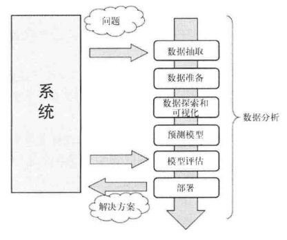
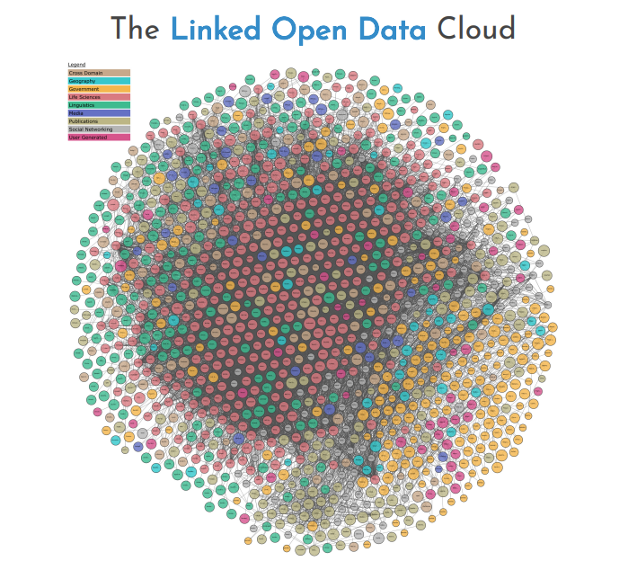

# 0.引言

## 0.1 什么是数据分析

当今世界对信息技术的依赖程度日渐加深，每天都会产生和存储海量的数据。数据的来源多种多样-一自动检测系统、传感器和科学仪器等。不知你有没有意识到，你每次从银行取钱、买东西、写博客、发微博也会产生新的数据。 
什么是数据呢?数据实际上不同于信息，至少在形式上不一样。对于没有任何形式可言的字节流，除了其数量、用词和发送的时间外，其他一无所知，一眼看上去，很难理解其本质。 
**信息实际上是对数据集进行处理，从中提炼出可用于其他场合的结论，也就是说，它是对数据进行处理后得到的结果。从原始数据中抽取信息的这个过程叫作数据分析。** 

## 0.2 数据分析需要掌握的知识范畴

数据分析学科研究的问题面很广。数据分析过程要用到多种工具和方法，它们对计算、数学和统计思维要求较高。 
因此，进行数据分析师必须具备多个学科的知识和实际应用能力。这些学科中有的是数据分析方法的基础，熟练掌握它们很有必要。根据应用领域、研究项目的不同，**可能还需要掌握其他相关学科的知识**。总的来说，这些知识可以帮助分析师更好地理解研究对象以及需要什么样的数据。 

**涵盖知识范围：**
***
1) *计算机科学* 
计算机软件（IDL、MATLAB等），编程语言（C++、Java、Python等），数据库（常见数据格式：XML、JSON、XLS、CSV等），网页抓取，抽取数据等。

2) *数学和统计学* 
常用统计技术有：贝叶斯方法、回归、聚类等。

3) *机器学习和人工智能*

4) *数据来源领域* 
对数据来源领域有深入的理解，能够提升解释数据的能力。

## 0.3 理解数据的性质

数据分析所研究的对象自然是数据。在数据分析的各个阶段，数据都是主要关注对象。要分析、处理的原材料由数据构成。**经过处理、分析数据后，最终可能会从中得到有用的信息。**这些信息能够增加对研究对象，也就是产生原始数据的系统理解。

## 0.4 数据分析过程

数据分析过程可以用以下几步来描述:转换和处理原始数据，以**可视化方式呈现数据**，建模做预测。因此，数据分析无外乎由几步组成，其中每一步所起的作用对后面几步而言都至关重要。因此数据分析几乎可以概括为由以下几个阶段组成的过程链: 
 
- **本课程需要掌握的过程：**
1. 问题定义 
数据分析总是要始于要解决的问题，而这个问题需要事先定义。

2. 数据抽取 
选择数据获取的方式，以及数据源。

3. 数据准备 
将获得的数据进行清洗、转换。

4. 数据探索和可视化 
探索数据本质上是指从图形或统计数字中搜寻数据，以发现数据中的模式、联系和关系。数据可视化是突出显示可能的模式的最佳工具。

5. *数据分析报告* 
运用数据来反映、研究和分析某项事物的现状、问题和原因，发现其基本和规律，得出分析的结论并给出解决方案，是数据分析过程和思路的最后呈现。

## 0.5 开放数据源

为了满足日益增长的数据需求，人们把很多数据资源放到了因特网上。这些被称为开放数据(Open Data)的数据资源对任何有数据需求的人免费开放。 
下面是网上的一些开放数据资源站点:
- DataHub网站(http://datahub.io/dataset )
- 世界卫生组织(http://www.who.int/research/en/)
- Data.gov网站(http://data.gov)
- 欧盟开放数据门户(http://open-data.europa.eu/en/data/)
- 亚马逊AWS开放数据集(http://aws.amazon.com/datasets)
- Facebook Graph (http://developers.facebook.com/docs/graph-api)
- Healthdata.gov网站(http://www.healthdata.gov)
- 谷歌趋势(http://www.google.com/trends/explore )
- 谷歌金融(https://www.google.com/finance)
- Google Books Ngrams项目(http://storage.googleapis.com/books/ngrams/books/datasetsv2. html)
- UCI机器学习数据库(http://archive.ics.uci.edu/ml/) 

就开放数据而言，你可以通过LOD云图（ http://lod-cloud.net )了解网上都有哪些开放数据资源可用。从云图中你能看到当前网上有哪些开放数据资源，以及这些资源之间的关系。如下图所示： 

## 0.6 Python和数据分析
Python大量的库为数据分析和处理提供了完整的工具集，因此它被广泛应用于科学计算领域。 
比起R和Matlab等其他主要用于数据分析的编程语言，Python不仅提供数据处理平台，而且还有其他语言和专业应用所没有的特点。Python库一直在增加，算法的实现采用更具创新性的方法，再加上它能跟很多语言(C和Fortran)相对接，这些特点都使得Python在所有可用于数据分析的语言中与众不同。 
进一步来说，Python其实不是专用于数据分析的，它还有很多其他方面的用途。比如，它本身是一门通用型编程语言，也可以作脚本来用，还能操作数据库;而且由于Django等框架的问世，Python近些年还用来开发Web应用。因此，使用Python开发的数据分析项目，完全可以跟Web服务器相兼容，也就可以整合到Web应用中。 
因此，作为数据分析活动的工具角度来看，Python以及它众多的包，**在可以预见的将来会是最佳的选择**。
