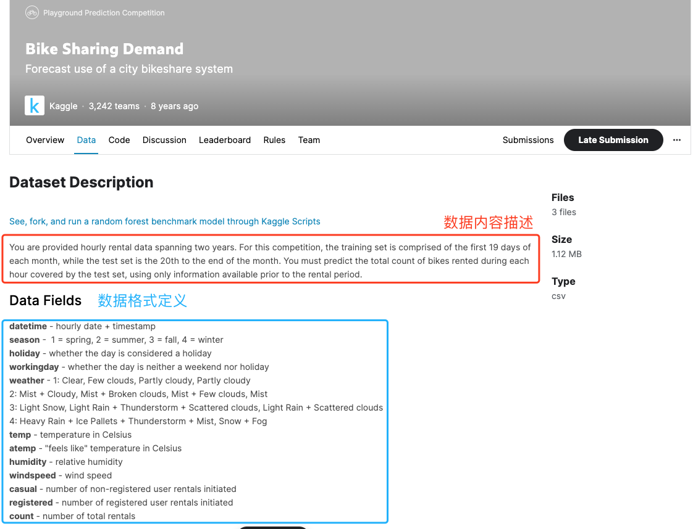

# 数据分析

## 2.数据抽取（采集、获取方式）

数据采集的方法有很多，目前较为广泛使用的传感器数据采集和互联网数据。

1. 传感数据采集
   * 传感数据是由传感设备收集和测量的数据，传感设备可穿戴在用户身上，也可以设计在现实环境中。
2. 互联网数据采集
   * 互联网数据采集是指利用互联网搜索引擎技术实现有针对性、行业性的数据抓取，并按照一定规则和筛选标准进行数据归类，最终形成数据库文件的一个过程。
     一般过程：获取网页、解析网页、保存数据。
3. 下载开源数据集
   * 目前有些网站提供一些开源数据，无需用户通过数据抓取的方式，可以直接下载数据用于数据分析练习，如“0.5”章节中提到的相关开源数据网站。本次数据分析实验，也是通过这个方式进行数据获取。

### 2.1 互联网数据采集

#### 2.1.1 获取网页 P84

在这一节中，我们将学习如何使用 `requests`库来获取网页的内容。我们将通过一个简单的例子来讲解这个过程，即如何获取并打印“百度”主页的 HTML 源码。

* **requests库**这是一个非常流行且易于使用的“Python”库，用于发送“HTTP”请求。这个库的设计目标是使“HTTP”请求尽可能简单易用。它对于各种网络请求场景都非常有用，从简单的网页抓取到与 RESTful API 的交互等。
* **操作步骤**

> 1.导入 **requests** 库，这个库允许我们方便地发送 **HTTP** 请求：`import requests`
>
>
> 2.定义一个变量 **url** ，这个变量包含了我们想要获取的网页的地址：`url = "https://www.baidu.com/"`
>
>
> 3.使用 **requests.get()** 函数来发送一个 **GET** 请求到我们刚才定义的 **URL**：`html = requests.get(url)`
> **GET** 请求是 **HTTP** 请求的一种，通常用于请求数据。这个函数会返回一个响应对象，我们将它保存在变量 **html** 中
>
>
> 4.由于网页内容可能使用不同的字符编码，我们可以指定编码确保内容正确显示：`html.encoding = "utf-8"`
> 对于大多数网页，**'utf-8'** 编码是一个安全的选择。
>
>
> 5.打印出响应对象中的文本内容，即网页的 **HTML** 源码：`print(html.text)`

* **示例代码**

```python
import requests

url = "https://www.bilibili.com/" #网址赋值
html = requests.get(url)       #用GET方法获取网页数据
html.encoding = "utf-8"        #设定网页编码方式：utf-8

print(html.text)  #输出结果
```

* 运行结果

```
`<!DOCTYPE HTML PUBLIC "-//W3C//DTD HTML 4.01 Transitional//EN">`
    `<html lang="zh-cn">`

    `<head>`
        `<meta http-equiv="Access-Control-Allow-Origin" content="*" />`
        `<meta http-equiv="Page-Enter" content="blendTrans(Duration=0.5)">`
        `<meta http-equiv="Page-Exit" content="blendTrans(Duration=0.5)">`
        `<meta http-equiv="Content-Type" content="text/html; charset=utf-8">`
        `<meta name="viewport" content="width=device-width, user-scalable=no, initial-scale=1.0, maximum-scale=1.0, minimum-scale=1.0">`
        `<meta name="spm_prefix" content="333.937">`
        `<title>`出错啦! - bilibili.com `</title>`
        `<link rel="shortcut icon" href="//static.hdslb.com/images/favicon.ico">`
        `<script type="text/javascript" src="//s1.hdslb.com/bfs/static/jinkela/long/js/jquery/jquery1.7.2.min.js"></script>`

    `</head>`

    `<body>`
        `<div class="error-container">`
            `<div class="txt-item err-code">`错误号:412 `</div>`
            `<div class="txt-item err-text">`由于触发哔哩哔哩安全风控策略，该次访问请求被拒绝。`</div>`
            `<div class="txt-item">`The request was rejected because of the bilibili security control policy.`</div>`
            `<div class="txt-item datetime_now"></div>`
            `<div class="txt-item user_url"></div>`
            `<div class="txt-item user_ip"></div>`
            `<div class="txt-item user_id"></div>`
            `<div class="check-input">`
                `<div class="title"></div>`
                `<div class="box-pic"></div>`
                `<div class="box"></div>`
                `<div class="state"></div>`
            `</div>`
        `</div>`
        `<script type="text/javascript" charset="utf-8" src="//security.bilibili.com/static/js/sha256.min.js"></script>`
        `<script type="text/javascript" charset="utf-8" src="//security.bilibili.com/static/js/js.cookie.min.js"></script>`
        `<script type="text/javascript" charset="utf-8" src="//security.bilibili.com/static/js/412.js"></script>`
    `</body>`
    `</html>`
```

#### 练习1:获取“共享单车数据“网页信息

在这个练习中，你将学习如何使用 **requests** 库来获取运行在本地服务器上的“共享单车数据”网页内容。你的任务是编写一个程序，该程序能够连接到本地服务器的 **IP** 地址 ` http://127.0.0.1:8080`，并请求网页的数据。

* **请按照以下步骤操作：**

1. 导入 requests 库。
2. 定义目标网址变量。
3. 使用 requests.get() 发送 GET 请求到服务器。
4. 设置响应的编码为 'utf-8' 以正确显示文本。
5. 打印响应文本，即网页的 HTML 源码。

```python
import requests

url = "http://10.50.121.234:8080"

bike_data_page = requests.get(url)       #用GET方法获取网页数据
bike_data_page.encoding = "utf-8"        #设定网页编码方式：utf-8

print(bike_data_page.text)  #输出结果
```

* 运行结果

```htm
`<!DOCTYPE html>`
    `<html lang="en">`
    `<head>`
        `<meta charset="UTF-8">`
        `<meta name="viewport" content="width=device-width, initial-scale=1.0">`
        `<title>`共享单车数据 `</title>`
        `<style>`
            body {
                font-family: Arial, sans-serif;
                margin: 0;
                padding: 0;
                background-color: #f4f4f4;
            }
            header {
                background-color: #333;
                color: #fff;
                text-align: center;
                padding: 1em 0;
            }
            h1 {
                margin: 0;
            }
            table {
                width: 100%;
                margin-top: 20px;
                border-collapse: collapse;
            }
            th, td {
                border: 1px solid #ddd;
                padding: 8px;
                text-align: left;
            }
            th {
                background-color: #4CAF50;
                color: white;
            }
            tr:nth-child(even) {
                background-color: #f2f2f2;
            }
        `</style>`
    `</head>`
    `<body>`
        `<header>`
            `<h1>`共享单车数据 `</h1>`
        `</header>`
        `<main>`
            `<table>`
                `<tr>`
                    `<th>`Index `</th>`
                    `<th>`Bike ID `</th>`
                    `<th>`Datetime `</th>`
                    `<th>`Date `</th>`
                    `<th>`Month `</th>`
                    `<th>`Season `</th>`
                    `<th>`Working Day `</th>`
                    `<th>`Localhost `</th>`
                    `<th>`Weather `</th>`
                    `<th>`Daytime `</th>`
                    `<th>`Temp Value `</th>`
                    `<th>`Temp Unit `</th>`
                    `<th>`Wind Speed `</th>`
                    `<th>`Wind Unit `</th>`
                `</tr>`

    `<tr>`
                    `<td>`1170070`</td>`
                    `<td>`mr3774`</td>`
                    `<td>`18:14:00`</td>`
                    `<td>`7月10日`</td>`
                    `<td>`7`</td>`
                    `<td>`Summer`</td>`
                    `<td>`No`</td>`
                    `<td>`图书馆`</td>`
                    `<td>`Mostly cloudy`</td>`
                    `<td>`TRUE`</td>`
                    `<td>`6.1`</td>`
                    `<td>`C`</td>`
                    `<td>`1.9`</td>`
                    `<td>`km/h`</td>`
                `</tr>`

    `<tr>`
                    `<td>`1170071`</td>`
                    `<td>`mr5322`</td>`
                    `<td>`18:14:00`</td>`
                    `<td>`7月10日`</td>`
                    `<td>`7`</td>`
                    `<td>`Summer`</td>`
                    `<td>`No`</td>`
                    `<td>`图书馆`</td>`
                    `<td>`Mostly cloudy`</td>`
                    `<td>`TRUE`</td>`
                    `<td>`6.1`</td>`
                    `<td>`C`</td>`
                    `<td>`1.9`</td>`
                    `<td>`km/h`</td>`
                `</tr>`

    `<tr>`
                    `<td>`1170072`</td>`
                    `<td>`mr197`</td>`
                    `<td>`18:14:00`</td>`
                    `<td>`7月10日`</td>`
                    `<td>`7`</td>`
                    `<td>`Summer`</td>`
                    `<td>`No`</td>`
                    `<td>`图书馆`</td>`
                    `<td>`Mostly cloudy`</td>`
                    `<td>`TRUE`</td>`
                    `<td>`6.1`</td>`
                    `<td>`C`</td>`
                    `<td>`1.9`</td>`
                    `<td>`km/h`</td>`
                `</tr>`

    `<tr>`
                    `<td>`1170075`</td>`
                    `<td>`mr4877`</td>`
                    `<td>`18:15:00`</td>`
                    `<td>`7月10日`</td>`
                    `<td>`7`</td>`
                    `<td>`Summer`</td>`
                    `<td>`No`</td>`
                    `<td>`莘庄`</td>`
                    `<td>`Mostly cloudy`</td>`
                    `<td>`TRUE`</td>`
                    `<td>`6.1`</td>`
                    `<td>`C`</td>`
                    `<td>`1.9`</td>`
                    `<td>`km/h`</td>`
                `</tr>`

    `<tr>`
                    `<td>`1170077`</td>`
                    `<td>`mr5037`</td>`
                    `<td>`18:17:00`</td>`
                    `<td>`7月10日`</td>`
                    `<td>`7`</td>`
                    `<td>`Summer`</td>`
                    `<td>`No`</td>`
                    `<td>`图书馆`</td>`
                    `<td>`Mostly cloudy`</td>`
                    `<td>`TRUE`</td>`
                    `<td>`6.1`</td>`
                    `<td>`C`</td>`
                    `<td>`1.9`</td>`
                    `<td>`km/h`</td>`
                `</tr>`

    `<tr>`
                    `<td>`1170078`</td>`
                    `<td>`mr2785`</td>`
                    `<td>`18:17:00`</td>`
                    `<td>`7月10日`</td>`
                    `<td>`7`</td>`
                    `<td>`Summer`</td>`
                    `<td>`No`</td>`
                    `<td>`图书馆`</td>`
                    `<td>`Mostly cloudy`</td>`
                    `<td>`TRUE`</td>`
                    `<td>`6.1`</td>`
                    `<td>`C`</td>`
                    `<td>`1.9`</td>`
                    `<td>`km/h`</td>`
                `</tr>`

    `<tr>`
                    `<td>`1170079`</td>`
                    `<td>`mr4439`</td>`
                    `<td>`18:17:00`</td>`
                    `<td>`7月10日`</td>`
                    `<td>`7`</td>`
                    `<td>`Summer`</td>`
                    `<td>`No`</td>`
                    `<td>`图书馆`</td>`
                    `<td>`Mostly cloudy`</td>`
                    `<td>`TRUE`</td>`
                    `<td>`6.1`</td>`
                    `<td>`C`</td>`
                    `<td>`1.9`</td>`
                    `<td>`km/h`</td>`
                `</tr>`

    `<tr>`
                    `<td>`1170080`</td>`
                    `<td>`mr5233`</td>`
                    `<td>`18:01:32`</td>`
                    `<td>`7月10日`</td>`
                    `<td>`7`</td>`
                    `<td>`Summer`</td>`
                    `<td>`No`</td>`
                    `<td>`莘庄`</td>`
                    `<td>`Mostly cloudy`</td>`
                    `<td>`TRUE`</td>`
                    `<td>`6.1`</td>`
                    `<td>`C`</td>`
                    `<td>`1.9`</td>`
                    `<td>`km/h`</td>`
                `</tr>`

    `<tr>`
                    `<td>`1170081`</td>`
                    `<td>`mr8342`</td>`
                    `<td>`18:36:31`</td>`
                    `<td>`7月10日`</td>`
                    `<td>`7`</td>`
                    `<td>`Summer`</td>`
                    `<td>`No`</td>`
                    `<td>`图书馆`</td>`
                    `<td>`Mostly cloudy`</td>`
                    `<td>`TRUE`</td>`
                    `<td>`6.1`</td>`
                    `<td>`C`</td>`
                    `<td>`1.9`</td>`
                    `<td>`km/h`</td>`
                `</tr>`

    `<tr>`
                    `<td>`1170082`</td>`
                    `<td>`mr3054`</td>`
                    `<td>`18:53:51`</td>`
                    `<td>`7月10日`</td>`
                    `<td>`7`</td>`
                    `<td>`Summer`</td>`
                    `<td>`No`</td>`
                    `<td>`图书馆`</td>`
                    `<td>`Mostly cloudy`</td>`
                    `<td>`TRUE`</td>`
                    `<td>`6.1`</td>`
                    `<td>`C`</td>`
                    `<td>`1.9`</td>`
                    `<td>`km/h`</td>`
                `</tr>`

    `<tr>`
                    `<td>`1170083`</td>`
                    `<td>`mr9606`</td>`
                    `<td>`18:53:33`</td>`
                    `<td>`7月10日`</td>`
                    `<td>`7`</td>`
                    `<td>`Summer`</td>`
                    `<td>`No`</td>`
                    `<td>`图书馆`</td>`
                    `<td>`Mostly cloudy`</td>`
                    `<td>`TRUE`</td>`
                    `<td>`6.1`</td>`
                    `<td>`C`</td>`
                    `<td>`1.9`</td>`
                    `<td>`km/h`</td>`
                `</tr>`

    `<tr>`
                    `<td>`1170084`</td>`
                    `<td>`mr4158`</td>`
                    `<td>`18:23:20`</td>`
                    `<td>`7月10日`</td>`
                    `<td>`7`</td>`
                    `<td>`Summer`</td>`
                    `<td>`No`</td>`
                    `<td>`莘庄`</td>`
                    `<td>`Mostly cloudy`</td>`
                    `<td>`TRUE`</td>`
                    `<td>`6.1`</td>`
                    `<td>`C`</td>`
                    `<td>`1.9`</td>`
                    `<td>`km/h`</td>`
                `</tr>`

    `<tr>`
                    `<td>`1170085`</td>`
                    `<td>`mr8478`</td>`
                    `<td>`18:29:06`</td>`
                    `<td>`7月10日`</td>`
                    `<td>`7`</td>`
                    `<td>`Summer`</td>`
                    `<td>`No`</td>`
                    `<td>`莘庄`</td>`
                    `<td>`Mostly cloudy`</td>`
                    `<td>`TRUE`</td>`
                    `<td>`6.1`</td>`
                    `<td>`C`</td>`
                    `<td>`1.9`</td>`
                    `<td>`km/h`</td>`
                `</tr>`

    `<tr>`
                    `<td>`1170086`</td>`
                    `<td>`mr7253`</td>`
                    `<td>`18:11:56`</td>`
                    `<td>`7月10日`</td>`
                    `<td>`7`</td>`
                    `<td>`Summer`</td>`
                    `<td>`No`</td>`
                    `<td>`图书馆`</td>`
                    `<td>`Mostly cloudy`</td>`
                    `<td>`TRUE`</td>`
                    `<td>`6.1`</td>`
                    `<td>`C`</td>`
                    `<td>`1.9`</td>`
                    `<td>`km/h`</td>`
                `</tr>`

    `<tr>`
                    `<td>`1170087`</td>`
                    `<td>`mr5692`</td>`
                    `<td>`18:17:03`</td>`
                    `<td>`7月10日`</td>`
                    `<td>`7`</td>`
                    `<td>`Summer`</td>`
                    `<td>`No`</td>`
                    `<td>`图书馆`</td>`
                    `<td>`Mostly cloudy`</td>`
                    `<td>`TRUE`</td>`
                    `<td>`6.1`</td>`
                    `<td>`C`</td>`
                    `<td>`1.9`</td>`
                    `<td>`km/h`</td>`
                `</tr>`

    `<tr>`
                    `<td>`1170088`</td>`
                    `<td>`mr6387`</td>`
                    `<td>`18:09:34`</td>`
                    `<td>`7月10日`</td>`
                    `<td>`7`</td>`
                    `<td>`Summer`</td>`
                    `<td>`No`</td>`
                    `<td>`图书馆`</td>`
                    `<td>`Mostly cloudy`</td>`
                    `<td>`TRUE`</td>`
                    `<td>`6.1`</td>`
                    `<td>`C`</td>`
                    `<td>`1.9`</td>`
                    `<td>`km/h`</td>`
                `</tr>`

    `<tr>`
                    `<td>`1170089`</td>`
                    `<td>`mr8700`</td>`
                    `<td>`18:19:59`</td>`
                    `<td>`7月10日`</td>`
                    `<td>`7`</td>`
                    `<td>`Summer`</td>`
                    `<td>`No`</td>`
                    `<td>`莘庄`</td>`
                    `<td>`Mostly cloudy`</td>`
                    `<td>`TRUE`</td>`
                    `<td>`6.1`</td>`
                    `<td>`C`</td>`
                    `<td>`1.9`</td>`
                    `<td>`km/h`</td>`
                `</tr>`

    `<tr>`
                    `<td>`1170090`</td>`
                    `<td>`mr3476`</td>`
                    `<td>`18:18:52`</td>`
                    `<td>`7月10日`</td>`
                    `<td>`7`</td>`
                    `<td>`Summer`</td>`
                    `<td>`No`</td>`
                    `<td>`图书馆`</td>`
                    `<td>`Mostly cloudy`</td>`
                    `<td>`TRUE`</td>`
                    `<td>`6.1`</td>`
                    `<td>`C`</td>`
                    `<td>`1.9`</td>`
                    `<td>`km/h`</td>`
                `</tr>`

    `<tr>`
                    `<td>`1170091`</td>`
                    `<td>`mr1566`</td>`
                    `<td>`18:23:07`</td>`
                    `<td>`7月10日`</td>`
                    `<td>`7`</td>`
                    `<td>`Summer`</td>`
                    `<td>`No`</td>`
                    `<td>`莘庄`</td>`
                    `<td>`Mostly cloudy`</td>`
                    `<td>`TRUE`</td>`
                    `<td>`6.1`</td>`
                    `<td>`C`</td>`
                    `<td>`1.9`</td>`
                    `<td>`km/h`</td>`
                `</tr>`

    `<tr>`
                    `<td>`1170092`</td>`
                    `<td>`mr5498`</td>`
                    `<td>`18:33:57`</td>`
                    `<td>`7月10日`</td>`
                    `<td>`7`</td>`
                    `<td>`Summer`</td>`
                    `<td>`No`</td>`
                    `<td>`图书馆`</td>`
                    `<td>`Mostly cloudy`</td>`
                    `<td>`TRUE`</td>`
                    `<td>`6.1`</td>`
                    `<td>`C`</td>`
                    `<td>`1.9`</td>`
                    `<td>`km/h`</td>`
                `</tr>`

    `<tr>`
                    `<td>`1170093`</td>`
                    `<td>`mr1582`</td>`
                    `<td>`18:33:10`</td>`
                    `<td>`7月10日`</td>`
                    `<td>`7`</td>`
                    `<td>`Summer`</td>`
                    `<td>`No`</td>`
                    `<td>`图书馆`</td>`
                    `<td>`Mostly cloudy`</td>`
                    `<td>`TRUE`</td>`
                    `<td>`6.1`</td>`
                    `<td>`C`</td>`
                    `<td>`1.9`</td>`
                    `<td>`km/h`</td>`
                `</tr>`

    `<tr>`
                    `<td>`1170094`</td>`
                    `<td>`mr8897`</td>`
                    `<td>`18:01:56`</td>`
                    `<td>`7月10日`</td>`
                    `<td>`7`</td>`
                    `<td>`Summer`</td>`
                    `<td>`No`</td>`
                    `<td>`莘庄`</td>`
                    `<td>`Mostly cloudy`</td>`
                    `<td>`TRUE`</td>`
                    `<td>`6.1`</td>`
                    `<td>`C`</td>`
                    `<td>`1.9`</td>`
                    `<td>`km/h`</td>`
                `</tr>`

    `<tr>`
                    `<td>`1170095`</td>`
                    `<td>`mr1883`</td>`
                    `<td>`18:12:39`</td>`
                    `<td>`7月10日`</td>`
                    `<td>`7`</td>`
                    `<td>`Summer`</td>`
                    `<td>`No`</td>`
                    `<td>`图书馆`</td>`
                    `<td>`Mostly cloudy`</td>`
                    `<td>`TRUE`</td>`
                    `<td>`6.1`</td>`
                    `<td>`C`</td>`
                    `<td>`1.9`</td>`
                    `<td>`km/h`</td>`
                `</tr>`

    `<tr>`
                    `<td>`1170096`</td>`
                    `<td>`mr9865`</td>`
                    `<td>`18:34:02`</td>`
                    `<td>`7月10日`</td>`
                    `<td>`7`</td>`
                    `<td>`Summer`</td>`
                    `<td>`No`</td>`
                    `<td>`莘庄`</td>`
                    `<td>`Mostly cloudy`</td>`
                    `<td>`TRUE`</td>`
                    `<td>`6.1`</td>`
                    `<td>`C`</td>`
                    `<td>`1.9`</td>`
                    `<td>`km/h`</td>`
                `</tr>`

    `<tr>`
                    `<td>`1170097`</td>`
                    `<td>`mr3000`</td>`
                    `<td>`18:47:15`</td>`
                    `<td>`7月10日`</td>`
                    `<td>`7`</td>`
                    `<td>`Summer`</td>`
                    `<td>`No`</td>`
                    `<td>`图书馆`</td>`
                    `<td>`Mostly cloudy`</td>`
                    `<td>`TRUE`</td>`
                    `<td>`6.1`</td>`
                    `<td>`C`</td>`
                    `<td>`1.9`</td>`
                    `<td>`km/h`</td>`
                `</tr>`

    `<tr>`
                    `<td>`1170098`</td>`
                    `<td>`mr4582`</td>`
                    `<td>`18:31:34`</td>`
                    `<td>`7月10日`</td>`
                    `<td>`7`</td>`
                    `<td>`Summer`</td>`
                    `<td>`No`</td>`
                    `<td>`图书馆`</td>`
                    `<td>`Mostly cloudy`</td>`
                    `<td>`TRUE`</td>`
                    `<td>`6.1`</td>`
                    `<td>`C`</td>`
                    `<td>`1.9`</td>`
                    `<td>`km/h`</td>`
                `</tr>`

    `<tr>`
                    `<td>`1170099`</td>`
                    `<td>`mr6177`</td>`
                    `<td>`18:07:28`</td>`
                    `<td>`7月10日`</td>`
                    `<td>`7`</td>`
                    `<td>`Summer`</td>`
                    `<td>`No`</td>`
                    `<td>`图书馆`</td>`
                    `<td>`Mostly cloudy`</td>`
                    `<td>`TRUE`</td>`
                    `<td>`6.1`</td>`
                    `<td>`C`</td>`
                    `<td>`1.9`</td>`
                    `<td>`km/h`</td>`
                `</tr>`

    `<tr>`
                    `<td>`1170100`</td>`
                    `<td>`mr8438`</td>`
                    `<td>`18:36:26`</td>`
                    `<td>`7月10日`</td>`
                    `<td>`7`</td>`
                    `<td>`Summer`</td>`
                    `<td>`No`</td>`
                    `<td>`莘庄`</td>`
                    `<td>`Mostly cloudy`</td>`
                    `<td>`TRUE`</td>`
                    `<td>`6.1`</td>`
                    `<td>`C`</td>`
                    `<td>`1.9`</td>`
                    `<td>`km/h`</td>`
                `</tr>`

    `<tr>`
                    `<td>`1170101`</td>`
                    `<td>`mr5203`</td>`
                    `<td>`18:12:15`</td>`
                    `<td>`7月10日`</td>`
                    `<td>`7`</td>`
                    `<td>`Summer`</td>`
                    `<td>`No`</td>`
                    `<td>`莘庄`</td>`
                    `<td>`Mostly cloudy`</td>`
                    `<td>`TRUE`</td>`
                    `<td>`6.1`</td>`
                    `<td>`C`</td>`
                    `<td>`1.9`</td>`
                    `<td>`km/h`</td>`
                `</tr>`

    `<tr>`
                    `<td>`1170102`</td>`
                    `<td>`mr5403`</td>`
                    `<td>`18:30:18`</td>`
                    `<td>`7月10日`</td>`
                    `<td>`7`</td>`
                    `<td>`Summer`</td>`
                    `<td>`No`</td>`
                    `<td>`莘庄`</td>`
                    `<td>`Mostly cloudy`</td>`
                    `<td>`TRUE`</td>`
                    `<td>`6.1`</td>`
                    `<td>`C`</td>`
                    `<td>`1.9`</td>`
                    `<td>`km/h`</td>`
                `</tr>`

    `</table>`
        `</main>`
    `</body>`
    `</html>`
```

#### 2.1.2解析网页（使用Beautifulsoup库） P85

接下来将深入探讨如何分析网页的结构。在前面已经学习了如何使用 **requests** 库获取网页的 **HTML** 数据。现在，要学习如何从这些数据中读取信息，这是掌握网页数据处理和提取的关键一步。通过观察 **HTML** 源码，可以识别信息是如何被组织的，特别是标题和数据是如何通过 `<th>` 和 `<td>` 标签表示的。理解这些HTML标签及其组织方式，对于学习数据抓取和网页开发至关重要。

* beautifulsoup使用参考文档https://beautifulsoup.readthedocs.io/zh_CN/v4.4.0/index.html#id13
* **selcet方法介绍**
  在 **Beautiful Soup** 中，**select** 方法允许你使用 **CSS** 选择器来定位页面中的元素。**CSS** 选择器是一种在**CSS**中用来选择你想要样式化的**HTML**元素的模式。**select** 方法返回一个列表，其中包含所有匹配的元素。

> 下面是一些使用 select 方法的例子：
> `soup.select("div")` 选择所有的"\<div>"元素。
> `soup.select("#some_id")` 选择 ID 为 some_id 的元素。
> `soup.select(".some_class")` 选择所有 class 包含 some_class 的元素。
> `soup.select("div span")` 选择所有在 "\<div>" 元素内的"\<span>" 元素。
> `soup.select("div > span") `选择所有直接位于"\<div>" 元素内部的 "\<span>" 元素。

* **示例代码**
  获取网页中“\<header>”标签内数据

```python
from bs4 import BeautifulSoup #新导入的库文件

soup = BeautifulSoup(bike_data_page.text,'html.parser')  #建立soup对象，获取网页源代码
select_data = soup.select("header")

print(select_data)
```

* 运行结果

```html
[`<header>`
    `<h1>`共享单车数据 `</h1>`
    `</header>`]
```

#### 练习2：分别找标题和数据的标签并记录

**注意：一定要先运行"练习1"代码！！再运行本行代码！！！！**

```python
from bs4 import BeautifulSoup #新导入的库文件

#使用select方法，抓取相关属性
soup = BeautifulSoup(bike_data_page.text,'html.parser')  #建立soup对象，获取网页源代码
select_head = soup.select("th")   #获取标题数据
select_data = soup.select("td")   #获取单车数据

print(select_head)
print(select_data)
```

* 运行结果

```html
[`<th>`Index `</th>`, `<th>`Bike ID `</th>`, `<th>`Datetime `</th>`, `<th>`Date `</th>`, `<th>`Month `</th>`, `<th>`Season `</th>`, `<th>`Working Day `</th>`, `<th>`Localhost `</th>`, `<th>`Weather `</th>`, `<th>`Daytime `</th>`, `<th>`Temp Value `</th>`, `<th>`Temp Unit `</th>`, `<th>`Wind Speed `</th>`, `<th>`Wind Unit `</th>`]
[`<td>`1170070 `</td>`, `<td>`mr3774 `</td>`, `<td>`18:14:00 `</td>`, `<td>`7月10日 `</td>`, `<td>`7 `</td>`, `<td>`Summer `</td>`, `<td>`No `</td>`, `<td>`图书馆 `</td>`, `<td>`Mostly cloudy `</td>`, `<td>`TRUE `</td>`, `<td>`6.1 `</td>`, `<td>`C `</td>`, `<td>`1.9 `</td>`, `<td>`km/h `</td>`, `<td>`1170071 `</td>`, `<td>`mr5322 `</td>`, `<td>`18:14:00 `</td>`, `<td>`7月10日 `</td>`, `<td>`7 `</td>`, `<td>`Summer `</td>`, `<td>`No `</td>`, `<td>`图书馆 `</td>`, `<td>`Mostly cloudy `</td>`, `<td>`TRUE `</td>`, `<td>`6.1 `</td>`, `<td>`C `</td>`, `<td>`1.9 `</td>`, `<td>`km/h `</td>`, `<td>`1170072 `</td>`, `<td>`mr197 `</td>`, `<td>`18:14:00 `</td>`, `<td>`7月10日 `</td>`, `<td>`7 `</td>`, `<td>`Summer `</td>`, `<td>`No `</td>`, `<td>`图书馆 `</td>`, `<td>`Mostly cloudy `</td>`, `<td>`TRUE `</td>`, `<td>`6.1 `</td>`, `<td>`C `</td>`, `<td>`1.9 `</td>`, `<td>`km/h `</td>`, `<td>`1170075 `</td>`, `<td>`mr4877 `</td>`, `<td>`18:15:00 `</td>`, `<td>`7月10日 `</td>`, `<td>`7 `</td>`, `<td>`Summer `</td>`, `<td>`No `</td>`, `<td>`莘庄 `</td>`, `<td>`Mostly cloudy `</td>`, `<td>`TRUE `</td>`, `<td>`6.1 `</td>`, `<td>`C `</td>`, `<td>`1.9 `</td>`, `<td>`km/h `</td>`, `<td>`1170077 `</td>`, `<td>`mr5037 `</td>`, `<td>`18:17:00 `</td>`, `<td>`7月10日 `</td>`, `<td>`7 `</td>`, `<td>`Summer `</td>`, `<td>`No `</td>`, `<td>`图书馆 `</td>`, `<td>`Mostly cloudy `</td>`, `<td>`TRUE `</td>`, `<td>`6.1 `</td>`, `<td>`C `</td>`, `<td>`1.9 `</td>`, `<td>`km/h `</td>`, `<td>`1170078 `</td>`, `<td>`mr2785 `</td>`, `<td>`18:17:00 `</td>`, `<td>`7月10日 `</td>`, `<td>`7 `</td>`, `<td>`Summer `</td>`, `<td>`No `</td>`, `<td>`图书馆 `</td>`, `<td>`Mostly cloudy `</td>`, `<td>`TRUE `</td>`, `<td>`6.1 `</td>`, `<td>`C `</td>`, `<td>`1.9 `</td>`, `<td>`km/h `</td>`, `<td>`1170079 `</td>`, `<td>`mr4439 `</td>`, `<td>`18:17:00 `</td>`, `<td>`7月10日 `</td>`, `<td>`7 `</td>`, `<td>`Summer `</td>`, `<td>`No `</td>`, `<td>`图书馆 `</td>`, `<td>`Mostly cloudy `</td>`, `<td>`TRUE `</td>`, `<td>`6.1 `</td>`, `<td>`C `</td>`, `<td>`1.9 `</td>`, `<td>`km/h `</td>`, `<td>`1170080 `</td>`, `<td>`mr5233 `</td>`, `<td>`18:01:32 `</td>`, `<td>`7月10日 `</td>`, `<td>`7 `</td>`, `<td>`Summer `</td>`, `<td>`No `</td>`, `<td>`莘庄 `</td>`, `<td>`Mostly cloudy `</td>`, `<td>`TRUE `</td>`, `<td>`6.1 `</td>`, `<td>`C `</td>`, `<td>`1.9 `</td>`, `<td>`km/h `</td>`, `<td>`1170081 `</td>`, `<td>`mr8342 `</td>`, `<td>`18:36:31 `</td>`, `<td>`7月10日 `</td>`, `<td>`7 `</td>`, `<td>`Summer `</td>`, `<td>`No `</td>`, `<td>`图书馆 `</td>`, `<td>`Mostly cloudy `</td>`, `<td>`TRUE `</td>`, `<td>`6.1 `</td>`, `<td>`C `</td>`, `<td>`1.9 `</td>`, `<td>`km/h `</td>`, `<td>`1170082 `</td>`, `<td>`mr3054 `</td>`, `<td>`18:53:51 `</td>`, `<td>`7月10日 `</td>`, `<td>`7 `</td>`, `<td>`Summer `</td>`, `<td>`No `</td>`, `<td>`图书馆 `</td>`, `<td>`Mostly cloudy `</td>`, `<td>`TRUE `</td>`, `<td>`6.1 `</td>`, `<td>`C `</td>`, `<td>`1.9 `</td>`, `<td>`km/h `</td>`, `<td>`1170083 `</td>`, `<td>`mr9606 `</td>`, `<td>`18:53:33 `</td>`, `<td>`7月10日 `</td>`, `<td>`7 `</td>`, `<td>`Summer `</td>`, `<td>`No `</td>`, `<td>`图书馆 `</td>`, `<td>`Mostly cloudy `</td>`, `<td>`TRUE `</td>`, `<td>`6.1 `</td>`, `<td>`C `</td>`, `<td>`1.9 `</td>`, `<td>`km/h `</td>`, `<td>`1170084 `</td>`, `<td>`mr4158 `</td>`, `<td>`18:23:20 `</td>`, `<td>`7月10日 `</td>`, `<td>`7 `</td>`, `<td>`Summer `</td>`, `<td>`No `</td>`, `<td>`莘庄 `</td>`, `<td>`Mostly cloudy `</td>`, `<td>`TRUE `</td>`, `<td>`6.1 `</td>`, `<td>`C `</td>`, `<td>`1.9 `</td>`, `<td>`km/h `</td>`, `<td>`1170085 `</td>`, `<td>`mr8478 `</td>`, `<td>`18:29:06 `</td>`, `<td>`7月10日 `</td>`, `<td>`7 `</td>`, `<td>`Summer `</td>`, `<td>`No `</td>`, `<td>`莘庄 `</td>`, `<td>`Mostly cloudy `</td>`, `<td>`TRUE `</td>`, `<td>`6.1 `</td>`, `<td>`C `</td>`, `<td>`1.9 `</td>`, `<td>`km/h `</td>`, `<td>`1170086 `</td>`, `<td>`mr7253 `</td>`, `<td>`18:11:56 `</td>`, `<td>`7月10日 `</td>`, `<td>`7 `</td>`, `<td>`Summer `</td>`, `<td>`No `</td>`, `<td>`图书馆 `</td>`, `<td>`Mostly cloudy `</td>`, `<td>`TRUE `</td>`, `<td>`6.1 `</td>`, `<td>`C `</td>`, `<td>`1.9 `</td>`, `<td>`km/h `</td>`, `<td>`1170087 `</td>`, `<td>`mr5692 `</td>`, `<td>`18:17:03 `</td>`, `<td>`7月10日 `</td>`, `<td>`7 `</td>`, `<td>`Summer `</td>`, `<td>`No `</td>`, `<td>`图书馆 `</td>`, `<td>`Mostly cloudy `</td>`, `<td>`TRUE `</td>`, `<td>`6.1 `</td>`, `<td>`C `</td>`, `<td>`1.9 `</td>`, `<td>`km/h `</td>`, `<td>`1170088 `</td>`, `<td>`mr6387 `</td>`, `<td>`18:09:34 `</td>`, `<td>`7月10日 `</td>`, `<td>`7 `</td>`, `<td>`Summer `</td>`, `<td>`No `</td>`, `<td>`图书馆 `</td>`, `<td>`Mostly cloudy `</td>`, `<td>`TRUE `</td>`, `<td>`6.1 `</td>`, `<td>`C `</td>`, `<td>`1.9 `</td>`, `<td>`km/h `</td>`, `<td>`1170089 `</td>`, `<td>`mr8700 `</td>`, `<td>`18:19:59 `</td>`, `<td>`7月10日 `</td>`, `<td>`7 `</td>`, `<td>`Summer `</td>`, `<td>`No `</td>`, `<td>`莘庄 `</td>`, `<td>`Mostly cloudy `</td>`, `<td>`TRUE `</td>`, `<td>`6.1 `</td>`, `<td>`C `</td>`, `<td>`1.9 `</td>`, `<td>`km/h `</td>`, `<td>`1170090 `</td>`, `<td>`mr3476 `</td>`, `<td>`18:18:52 `</td>`, `<td>`7月10日 `</td>`, `<td>`7 `</td>`, `<td>`Summer `</td>`, `<td>`No `</td>`, `<td>`图书馆 `</td>`, `<td>`Mostly cloudy `</td>`, `<td>`TRUE `</td>`, `<td>`6.1 `</td>`, `<td>`C `</td>`, `<td>`1.9 `</td>`, `<td>`km/h `</td>`, `<td>`1170091 `</td>`, `<td>`mr1566 `</td>`, `<td>`18:23:07 `</td>`, `<td>`7月10日 `</td>`, `<td>`7 `</td>`, `<td>`Summer `</td>`, `<td>`No `</td>`, `<td>`莘庄 `</td>`, `<td>`Mostly cloudy `</td>`, `<td>`TRUE `</td>`, `<td>`6.1 `</td>`, `<td>`C `</td>`, `<td>`1.9 `</td>`, `<td>`km/h `</td>`, `<td>`1170092 `</td>`, `<td>`mr5498 `</td>`, `<td>`18:33:57 `</td>`, `<td>`7月10日 `</td>`, `<td>`7 `</td>`, `<td>`Summer `</td>`, `<td>`No `</td>`, `<td>`图书馆 `</td>`, `<td>`Mostly cloudy `</td>`, `<td>`TRUE `</td>`, `<td>`6.1 `</td>`, `<td>`C `</td>`, `<td>`1.9 `</td>`, `<td>`km/h `</td>`, `<td>`1170093 `</td>`, `<td>`mr1582 `</td>`, `<td>`18:33:10 `</td>`, `<td>`7月10日 `</td>`, `<td>`7 `</td>`, `<td>`Summer `</td>`, `<td>`No `</td>`, `<td>`图书馆 `</td>`, `<td>`Mostly cloudy `</td>`, `<td>`TRUE `</td>`, `<td>`6.1 `</td>`, `<td>`C `</td>`, `<td>`1.9 `</td>`, `<td>`km/h `</td>`, `<td>`1170094 `</td>`, `<td>`mr8897 `</td>`, `<td>`18:01:56 `</td>`, `<td>`7月10日 `</td>`, `<td>`7 `</td>`, `<td>`Summer `</td>`, `<td>`No `</td>`, `<td>`莘庄 `</td>`, `<td>`Mostly cloudy `</td>`, `<td>`TRUE `</td>`, `<td>`6.1 `</td>`, `<td>`C `</td>`, `<td>`1.9 `</td>`, `<td>`km/h `</td>`, `<td>`1170095 `</td>`, `<td>`mr1883 `</td>`, `<td>`18:12:39 `</td>`, `<td>`7月10日 `</td>`, `<td>`7 `</td>`, `<td>`Summer `</td>`, `<td>`No `</td>`, `<td>`图书馆 `</td>`, `<td>`Mostly cloudy `</td>`, `<td>`TRUE `</td>`, `<td>`6.1 `</td>`, `<td>`C `</td>`, `<td>`1.9 `</td>`, `<td>`km/h `</td>`, `<td>`1170096 `</td>`, `<td>`mr9865 `</td>`, `<td>`18:34:02 `</td>`, `<td>`7月10日 `</td>`, `<td>`7 `</td>`, `<td>`Summer `</td>`, `<td>`No `</td>`, `<td>`莘庄 `</td>`, `<td>`Mostly cloudy `</td>`, `<td>`TRUE `</td>`, `<td>`6.1 `</td>`, `<td>`C `</td>`, `<td>`1.9 `</td>`, `<td>`km/h `</td>`, `<td>`1170097 `</td>`, `<td>`mr3000 `</td>`, `<td>`18:47:15 `</td>`, `<td>`7月10日 `</td>`, `<td>`7 `</td>`, `<td>`Summer `</td>`, `<td>`No `</td>`, `<td>`图书馆 `</td>`, `<td>`Mostly cloudy `</td>`, `<td>`TRUE `</td>`, `<td>`6.1 `</td>`, `<td>`C `</td>`, `<td>`1.9 `</td>`, `<td>`km/h `</td>`, `<td>`1170098 `</td>`, `<td>`mr4582 `</td>`, `<td>`18:31:34 `</td>`, `<td>`7月10日 `</td>`, `<td>`7 `</td>`, `<td>`Summer `</td>`, `<td>`No `</td>`, `<td>`图书馆 `</td>`, `<td>`Mostly cloudy `</td>`, `<td>`TRUE `</td>`, `<td>`6.1 `</td>`, `<td>`C `</td>`, `<td>`1.9 `</td>`, `<td>`km/h `</td>`, `<td>`1170099 `</td>`, `<td>`mr6177 `</td>`, `<td>`18:07:28 `</td>`, `<td>`7月10日 `</td>`, `<td>`7 `</td>`, `<td>`Summer `</td>`, `<td>`No `</td>`, `<td>`图书馆 `</td>`, `<td>`Mostly cloudy `</td>`, `<td>`TRUE `</td>`, `<td>`6.1 `</td>`, `<td>`C `</td>`, `<td>`1.9 `</td>`, `<td>`km/h `</td>`, `<td>`1170100 `</td>`, `<td>`mr8438 `</td>`, `<td>`18:36:26 `</td>`, `<td>`7月10日 `</td>`, `<td>`7 `</td>`, `<td>`Summer `</td>`, `<td>`No `</td>`, `<td>`莘庄 `</td>`, `<td>`Mostly cloudy `</td>`, `<td>`TRUE `</td>`, `<td>`6.1 `</td>`, `<td>`C `</td>`, `<td>`1.9 `</td>`, `<td>`km/h `</td>`, `<td>`1170101 `</td>`, `<td>`mr5203 `</td>`, `<td>`18:12:15 `</td>`, `<td>`7月10日 `</td>`, `<td>`7 `</td>`, `<td>`Summer `</td>`, `<td>`No `</td>`, `<td>`莘庄 `</td>`, `<td>`Mostly cloudy `</td>`, `<td>`TRUE `</td>`, `<td>`6.1 `</td>`, `<td>`C `</td>`, `<td>`1.9 `</td>`, `<td>`km/h `</td>`, `<td>`1170102 `</td>`, `<td>`mr5403 `</td>`, `<td>`18:30:18 `</td>`, `<td>`7月10日 `</td>`, `<td>`7 `</td>`, `<td>`Summer `</td>`, `<td>`No `</td>`, `<td>`莘庄 `</td>`, `<td>`Mostly cloudy `</td>`, `<td>`TRUE `</td>`, `<td>`6.1 `</td>`, `<td>`C `</td>`, `<td>`1.9 `</td>`, `<td>`km/h `</td>`]
```

#### 练习3:整理获取的数据

在之前的步骤中，我们已经使用 **select** 方法成功获取了包含 **HTML** 标签的共享单车数据的标题和数据。下一步，我们需要遍历 **select_head** 和 **select_data** 列表，从中提取文本内容。这需要从每个标签对象中获取 **.text** 属性的值来去除 **HTML** 标签。最终目标是将标题和数据合并，形成一个结构化的二维数组，其中第一行是数据标题，后续行是对应的数据，这样就能清晰地展示每个数据点与其对应标题的关系。

* 查看标题、数据长度

```python
print("标题长度",len(select_head))
print("数据长度",len(select_data))
```

* 运行结果

```
标题长度 14
数据长度 420
```

接下来，我们将创建一个二维数组**bike_data**来组织这些数据。
首先，通过上述打印信息比较 **select_head** 和 **select_data** 列表的长度，我们可以得知总共有30组数据，因为标题的数量是14，而数据的数量是420。在遍历 **select_data** 时，我们会将每14个数据项作为一组，添加到二维数组的新行中。
转换过程如下图所示：


```python
bike_data = [] # 建立一个空的二维数组

full_data = select_head + select_data # 将标题和数据的列表合并
extracted_data = [] # 建立一个空列表，用于记录每次遍历的结果

# 遍历合并后的数据列表
for count, row_data in enumerate(full_data, 1):
    extracted_data.append(row_data.text) # 添加当前元素的文本到列表
  
    if count % 14 == 0:
        bike_data.append(extracted_data) # 每14个元素后，将累积的数据添加到二维数组中
        extracted_data = [] # 重置列表以用于下一组数据
    #end if
#end for

# 打印二维数组中的每一行
for i in bike_data:
    print(i)
```

* 运行结果

```
['Index', 'Bike ID', 'Datetime', 'Date', 'Month', 'Season', 'Working Day', 'Localhost', 'Weather', 'Daytime', 'Temp Value', 'Temp Unit', 'Wind Speed', 'Wind Unit']
['1170070', 'mr3774', '18:14:00', '7月10日', '7', 'Summer', 'No', '图书馆', 'Mostly cloudy', 'TRUE', '6.1', 'C', '1.9', 'km/h']
['1170071', 'mr5322', '18:14:00', '7月10日', '7', 'Summer', 'No', '图书馆', 'Mostly cloudy', 'TRUE', '6.1', 'C', '1.9', 'km/h']
['1170072', 'mr197', '18:14:00', '7月10日', '7', 'Summer', 'No', '图书馆', 'Mostly cloudy', 'TRUE', '6.1', 'C', '1.9', 'km/h']
['1170075', 'mr4877', '18:15:00', '7月10日', '7', 'Summer', 'No', '莘庄', 'Mostly cloudy', 'TRUE', '6.1', 'C', '1.9', 'km/h']
['1170077', 'mr5037', '18:17:00', '7月10日', '7', 'Summer', 'No', '图书馆', 'Mostly cloudy', 'TRUE', '6.1', 'C', '1.9', 'km/h']
['1170078', 'mr2785', '18:17:00', '7月10日', '7', 'Summer', 'No', '图书馆', 'Mostly cloudy', 'TRUE', '6.1', 'C', '1.9', 'km/h']
['1170079', 'mr4439', '18:17:00', '7月10日', '7', 'Summer', 'No', '图书馆', 'Mostly cloudy', 'TRUE', '6.1', 'C', '1.9', 'km/h']
['1170080', 'mr5233', '18:01:32', '7月10日', '7', 'Summer', 'No', '莘庄', 'Mostly cloudy', 'TRUE', '6.1', 'C', '1.9', 'km/h']
['1170081', 'mr8342', '18:36:31', '7月10日', '7', 'Summer', 'No', '图书馆', 'Mostly cloudy', 'TRUE', '6.1', 'C', '1.9', 'km/h']
['1170082', 'mr3054', '18:53:51', '7月10日', '7', 'Summer', 'No', '图书馆', 'Mostly cloudy', 'TRUE', '6.1', 'C', '1.9', 'km/h']
['1170083', 'mr9606', '18:53:33', '7月10日', '7', 'Summer', 'No', '图书馆', 'Mostly cloudy', 'TRUE', '6.1', 'C', '1.9', 'km/h']
['1170084', 'mr4158', '18:23:20', '7月10日', '7', 'Summer', 'No', '莘庄', 'Mostly cloudy', 'TRUE', '6.1', 'C', '1.9', 'km/h']
['1170085', 'mr8478', '18:29:06', '7月10日', '7', 'Summer', 'No', '莘庄', 'Mostly cloudy', 'TRUE', '6.1', 'C', '1.9', 'km/h']
['1170086', 'mr7253', '18:11:56', '7月10日', '7', 'Summer', 'No', '图书馆', 'Mostly cloudy', 'TRUE', '6.1', 'C', '1.9', 'km/h']
['1170087', 'mr5692', '18:17:03', '7月10日', '7', 'Summer', 'No', '图书馆', 'Mostly cloudy', 'TRUE', '6.1', 'C', '1.9', 'km/h']
['1170088', 'mr6387', '18:09:34', '7月10日', '7', 'Summer', 'No', '图书馆', 'Mostly cloudy', 'TRUE', '6.1', 'C', '1.9', 'km/h']
['1170089', 'mr8700', '18:19:59', '7月10日', '7', 'Summer', 'No', '莘庄', 'Mostly cloudy', 'TRUE', '6.1', 'C', '1.9', 'km/h']
['1170090', 'mr3476', '18:18:52', '7月10日', '7', 'Summer', 'No', '图书馆', 'Mostly cloudy', 'TRUE', '6.1', 'C', '1.9', 'km/h']
['1170091', 'mr1566', '18:23:07', '7月10日', '7', 'Summer', 'No', '莘庄', 'Mostly cloudy', 'TRUE', '6.1', 'C', '1.9', 'km/h']
['1170092', 'mr5498', '18:33:57', '7月10日', '7', 'Summer', 'No', '图书馆', 'Mostly cloudy', 'TRUE', '6.1', 'C', '1.9', 'km/h']
['1170093', 'mr1582', '18:33:10', '7月10日', '7', 'Summer', 'No', '图书馆', 'Mostly cloudy', 'TRUE', '6.1', 'C', '1.9', 'km/h']
['1170094', 'mr8897', '18:01:56', '7月10日', '7', 'Summer', 'No', '莘庄', 'Mostly cloudy', 'TRUE', '6.1', 'C', '1.9', 'km/h']
['1170095', 'mr1883', '18:12:39', '7月10日', '7', 'Summer', 'No', '图书馆', 'Mostly cloudy', 'TRUE', '6.1', 'C', '1.9', 'km/h']
['1170096', 'mr9865', '18:34:02', '7月10日', '7', 'Summer', 'No', '莘庄', 'Mostly cloudy', 'TRUE', '6.1', 'C', '1.9', 'km/h']
['1170097', 'mr3000', '18:47:15', '7月10日', '7', 'Summer', 'No', '图书馆', 'Mostly cloudy', 'TRUE', '6.1', 'C', '1.9', 'km/h']
['1170098', 'mr4582', '18:31:34', '7月10日', '7', 'Summer', 'No', '图书馆', 'Mostly cloudy', 'TRUE', '6.1', 'C', '1.9', 'km/h']
['1170099', 'mr6177', '18:07:28', '7月10日', '7', 'Summer', 'No', '图书馆', 'Mostly cloudy', 'TRUE', '6.1', 'C', '1.9', 'km/h']
['1170100', 'mr8438', '18:36:26', '7月10日', '7', 'Summer', 'No', '莘庄', 'Mostly cloudy', 'TRUE', '6.1', 'C', '1.9', 'km/h']
['1170101', 'mr5203', '18:12:15', '7月10日', '7', 'Summer', 'No', '莘庄', 'Mostly cloudy', 'TRUE', '6.1', 'C', '1.9', 'km/h']
['1170102', 'mr5403', '18:30:18', '7月10日', '7', 'Summer', 'No', '莘庄', 'Mostly cloudy', 'TRUE', '6.1', 'C', '1.9', 'km/h']
```

#### 2.1.3 数据存储

注意：一定要先运行上面代码！！再运行本行代码！！！！

```python
import pandas as pd

df = pd.DataFrame(bike_data[1:], columns=bike_data[0])

# 写入 CSV 文件
filename = 'bike_data.csv'
df.to_csv(filename, index=False)

print(f"数据已写入 {filename}")
```

* 运行结果

```
数据已写入 bike_data.csv
```

2.1.4 网络爬虫道德规范

请记住，获取网页内容时需要确保你遵循网站的 robots.txt 文件和服务条款，以免违反法律或道德规范。

* **以“百度”为例**
  要获取百度的 **robots.txt** 文件，通常只需在浏览器的地址栏中输入以下URL：
  `https://www.baidu.com/robots.txt`
  这将直接显示百度站点根目录下的 **robots.txt** 文件内容。根据 **robots.txt** 的协议，爬虫会首先检查这个文件来确定它们是否有权限抓取该站点的特定部分。如果 **robots.txt** 文件存在，爬虫将遵循其中定义的规则。如果不存在，爬虫将默认可以访问站点的所有部分。
  

### 2.2 下载开源数据集（*本次活动数据集来源*）

本次活动我们主要通过下载开源数据集的方式来获取数据，既然是通过网站上下载的数据集，那么我们就需要查看下载网站上给出的数据相关*内容说明*和*格式说明*，以便我们用正确的方式来打开和分析数据。`<br>`

- 如下图所示，这是某个网站上的开源数据，分别对数据内容和格式进行详细说明。
  

#### 2.2.1 数据内容说明

数据中包含某一年的某市某一区域内共享单车的每一次的租赁情况，期中包括时间、日期、月份、地点、天气等相关数据。`<br>`

- 数据总量：1509922条
- **数据样式如图所示：**
  

#### 2.2.2 数据格式说明

- index 索引
- bike_id 车辆编号
- datetime 时间（格式：hh:mm:ss）
- date 日期
- month 月份
- season 季节
- workingday 工作日（是：Yes，否：No）
- localhost 所在位置
- weather 天气
- isdaytime 是否白天（白天：True，晚上：False）
- temp_value 温度数值
- temp_unit 温度单位
- wind_speed 风速
- wind_unit 风速单位
