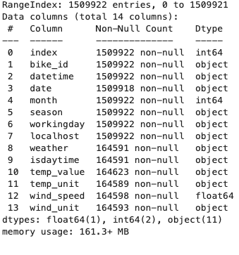
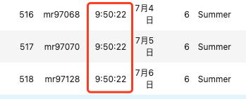
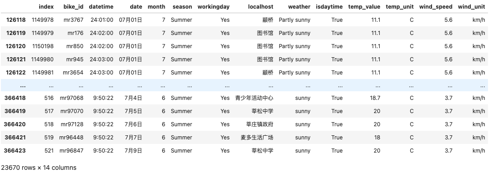
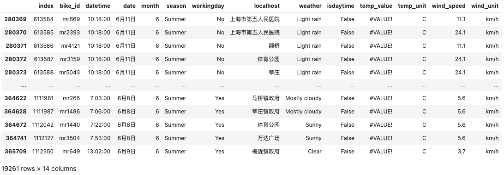

# 3.数据准备

本环节我们将进入数据分析准备阶段，原始数据并没有我们想象中的那么友好。有的数据会不符合格式，有的数据会缺失，所以我们在对数据可视化之前，需要将原始数据读取，然后将原始进行处理。祛除不符合要求格式的数据，从而才能将“洗”过的数据进行后面的统计、计算和加工。这个过程我们称之为“洗数据”。在实际运用中，我们会遇到各种情况，需要的数据类型不同，就要不同的处理方式，本章节我们将简单初步讲解如何简单的“洗数据”。——*老李*<br>
>这一部分我们将通过以下三个环节来完成：
> - 数据导入
> - 数据清洗
> - 数据初步分析

## 3.1 数据导入

### 3.1.1 Pandas库介绍 

* Pandas简介<br>
Pandas（发音：/ˈpændəz/）是 Python 语言开发的用于数据处理（data manipulation）和数据分析（data analysis）的第三方库。它擅长处理数字型数据和时间序列数据，当然文本型的数据也能轻松处理。<br><br>
* 名字来源<br>
Pandas 的命名来源并非「熊猫」，而是来自于计量经济学中术语**面板数据**（Panel data），它是一种数据集的结构类型，具有横截面和时间序列两个维度。不过，我们不用必须了解它，它只是一种灵感、思想来源。<br><br>
* 用途<br>
Pandas 对数据的处理是为数据的分析服务的，它所提供的各种数据处理方法、工具是基于数理统计学出发，包含了日常应用中的众多数据分析方法。我们学习它不光掌控它的相应操作技术，还要从它的处理思路中学习数据分析的理论和方法。<br>
    1.轻松应用在**金融、统计、数理研究、物理计算、社会科学、工程等领域里**；<br>
    2.**实现复杂的处理逻辑**，这些往往是 Excel 等工具无法处理的；<br>
    3.可以做到**非常震撼的可视化**，它对接众多的高颜值可视化库，可以实现动态数据交互效果。<br><br>
* 适用的数据<br>
Pandas 适合处理一个规正的二维数据（一维也可以，应用较少），即有 N 行 N 列，类似于 SQL 执行后产出的，或者 无合并单元格Excel 表格这样的数据。它可以把多个文件的数据合并在一起，如果结构不一样，也可以经过处理进行合并。<br>
这里说的二维数据是指，像一个矩形的平面在横向和纵向被分隔成多个格子，每个格子里存放一个数据。下图是一个 pandas 中定义的数据框架：<br>


### 3.1.2 导入数据并检查数据完整度


当我们拿到数据之后，我们需要看一下数据的完整性。从章节2.2.2中我们可以知道本次*数据总量*共计**1509922条**。我们导入数据之后通过使用info功能函数查看数据的基本信息。

- 示例代码
```python
import pandas as pd #导入pandas库

DataFilePath = "./bike_data.csv" #需要分析的数据文件路径

BikeDataFrame = pd.read_csv(DataFilePath,encoding='gb2312') #建立BikeDataFrame对象访问数据
BikeDataFrame.info() #显示数据基本信息
```

- 输出结果
```
<class 'pandas.core.frame.DataFrame'>
RangeIndex: 1509922 entries, 0 to 1509921
Data columns (total 14 columns):
 #   Column      Non-Null Count    Dtype  
---  ------      --------------    -----  
 0   index       1509922 non-null  int64  
 1   bike_id     1509922 non-null  object 
 2   datetime    1509922 non-null  object 
 3   date        1509918 non-null  object 
 4   month       1509922 non-null  int64  
 5   season      1509922 non-null  object 
 6   workingday  1509922 non-null  object 
 7   localhost   1509922 non-null  object 
 8   weather     164591 non-null   object 
 9   isdaytime   164591 non-null   object 
 10  temp_value  164623 non-null   object 
 11  temp_unit   164589 non-null   object 
 12  wind_speed  164598 non-null   float64
 13  wind_unit   164593 non-null   object 
dtypes: float64(1), int64(2), object(11)
memory usage: 161.3+ MB
```

* 代码解析<br>

`DataFilePath = "./bike_data.csv"`<br>
>这句话这里我们需要访问csv文件，该文件与我们的Python文件正好在同一个路径下，所以使用‘./’访问即可

`BikeDataFrame = pd.read_csv(DataFilePath,encoding='gb2312')`<br>
>建立BikeDataFrame对象<br>
通过read_csv方法来访问数据<br>
encoding表示数据字符编码方式,这里我们使用**gb2312**国标码，该参数不写默认编码为：utf-8。可以尝试使用默认编码，系统会报错如下图所示：<br>
<br>

`BikeDataFrame.info()`<br>
>建立完“BikeDataFrame”对象之后，就可以通过各种**方法（功能函数）**来访问、修改、调取“BikeDataFrame”中的数据。**<br>
本代码中调用"info"功能来查看文档中的数据大致情况，如上运行结果所示:<br>
>* '#'表示 默认索引序号<br>
>* 'Column' 表示数据中每一列的名称，对应章节2.2.2中的数据格式<br>
>* 'Non-Null Count' **这是我们重点要看的数据，这一列指我们数据中非空数据数量。**如果我们数据都是完整的，那么这一列所有的数值都是我们前文提到的“**1509922***”条数据。但是从结果来看，这个数据表里面的数据是有所缺少的，特别是从weather之后的数据量只有之前的1/10。如果我们要做天气类的数据分析，那么就需要舍弃掉很多不包含天气等相关因素的数据。<br>
>* 'Dtype'指数据的格式类型，目前我们可以看到大部份为object（通用数据格式），如果我们事先已经知道数据类型，可以在导入数据的时候设定对应的数据类型，这里我们不做讨论。<br>

### 3.1.3 查看数据具体情况

之前我们查看了数据基本信息，发现数据中有些数据缺失，还有一些数据的类型为object。那么我们导入的数据到底是一个什么样子的情况呢？这时候我们需要查看一下数据的具体情况，以便我们为之后的数据初步处理可以做出更加正确的方向和决策，也可以调整改进之前导入数据的方式，比如设定对应数据的类型。不再是object类型，以便后期的数据分析。

- 示例代码
```python
BikeDataFrame.head(10) #调用head功能查看数据具体情况
```

- 输出结果<br>
<br>


* 代码解析<br>
`head(10)`<br>
函数主要功能，显示前10行数据情况，不写参数时为系统默认数值5，也可以给更加大的数值用于观察数据的变化。这个是不是比用excel打开海量数据进行观察方便多了？<br>
这里的结果可以说明前面在3.1.2的问题，在weather之后的数据都是“NaN”的数值，这代表了数据都是空值，这就需要我们进一步处理了。

### 3.1.4 检测与处理重复值 P88

数据去掉重复数值这一步是我们在数据分析中经常会用到的，在某些特定的场景下需要去掉某些重复的数值。这里我们举例的就是对原始数据的处理，可能因为共享单车硬件的因素，比如在数据交换通信过程中，发生了通信异常，导致同一条数据被反复上传记录的情况时有发生。这里我们可以看到在6月份的时候，就有很多条在同一地点、同一个时间、同一天、同一个bike_ID的数据有多条记录。这个时候就需要我们使用`drop_duplicates()`功能函数来除去这些重复的数值。<br>

**当然，在数据除重的过程中，我们需要以下几个步骤：**

1.观察重复数值的形态<br>
在删除重复的数值之前，我们首先要了解到是什么数据重复了，主要重复的点在哪里，删除重复数据的时候需要哪些关键字，从而避免造成多删、误删、少删的情况出现。在这里我们可以看到，主要重复的数值关键字集中在“bike_id“、”datetime“、”date”、“localhost”这些上面。

- 示例代码
```python
BikeDataFrame[BikeDataFrame.duplicated(keep = False)].sort_values(["bike_id","datetime","date"]).head(10)
```
- 输出结果<br>
<br>


2.统计重复的数值<br>
当然，我们在看了重复数据之后，我们还需要统计一下重复的数值，可以通过`info()`功能来观察，发现共有2309条数据重复。（这里的重复指在已有数据的情况下，再出现的重复数据会被统计。）

- 示例代码
```python
BikeDataFrame[BikeDataFrame.duplicated()].info()
```

- 输出结果<br>
```
<class 'pandas.core.frame.DataFrame'>
Int64Index: 2309 entries, 120259 to 1417556
Data columns (total 14 columns):
 #   Column      Non-Null Count  Dtype  
---  ------      --------------  -----  
 0   index       2309 non-null   int64  
 1   bike_id     2309 non-null   object 
 2   datetime    2309 non-null   object 
 3   date        2309 non-null   object 
 4   month       2309 non-null   int64  
 5   season      2309 non-null   object 
 6   workingday  2309 non-null   object 
 7   localhost   2309 non-null   object 
 8   weather     371 non-null    object 
 9   isdaytime   371 non-null    object 
 10  temp_value  389 non-null    object 
 11  temp_unit   371 non-null    object 
 12  wind_speed  371 non-null    float64
 13  wind_unit   371 non-null    object 
dtypes: float64(1), int64(2), object(11)
memory usage: 270.6+ KB
```

3.删除重复的数值<br>
通过之前两个步骤的分析，我们已经锁定了“bike_id“、”datetime“、”date”、“localhost”这4个关键字。再进一步分析，同一辆车只可能在同一个出现在同一个地点。如下图所示，一辆单车在同一时间出现在了两个地点，所以这个时候我们在删除重复值的时候，不能将“localhost”考虑为除重关键字，不然会出现跨越空间的问题，本次数据集里面就有这么几条数据跨空间了，可以观察下图。<br>
<br>

- 示例代码
```python
BikeDataFrame.drop_duplicates(subset = ['bike_id','datetime','date'],  keep = 'first' , inplace = True)
```

* 代码解析<br>
`subset`关键字,表示根据关键字进行重复排查，排查优先级按照列表里面给的名称决定。<br>
`keep`关键字，‘first’表示出现重复的数据，只保留第一个数据，其余删除。<br>
`inplace`关键字，‘True’表示替换原表格数据，不返回处理好的新表格。

4.查看祛重结果<br>
删除掉重复的数值之后，查看一下相关数据结果。

- 示例代码
```python
BikeDataFrame.info()
```

- 输出结果<br>
```
<class 'pandas.core.frame.DataFrame'>
Int64Index: 1488664 entries, 0 to 1509921
Data columns (total 14 columns):
 #   Column      Non-Null Count    Dtype  
---  ------      --------------    -----  
 0   index       1488664 non-null  int64  
 1   bike_id     1488664 non-null  object 
 2   datetime    1488664 non-null  object 
 3   date        1488660 non-null  object 
 4   month       1488664 non-null  int64  
 5   season      1488664 non-null  object 
 6   workingday  1488664 non-null  object 
 7   localhost   1488664 non-null  object 
 8   weather     162426 non-null   object 
 9   isdaytime   162426 non-null   object 
 10  temp_value  162431 non-null   object 
 11  temp_unit   162424 non-null   object 
 12  wind_speed  162433 non-null   float64
 13  wind_unit   162428 non-null   object 
dtypes: float64(1), int64(2), object(11)
memory usage: 170.4+ MB
```

5.检测一下是否有重复的数值

- 示例代码
```python
BikeDataFrame[BikeDataFrame.duplicated()].info()
```
- 输出结果<br>
```
<class 'pandas.core.frame.DataFrame'>
Int64Index: 0 entries
Data columns (total 14 columns):
 #   Column      Non-Null Count  Dtype  
---  ------      --------------  -----  
 0   index       0 non-null      int64  
 1   bike_id     0 non-null      object 
 2   datetime    0 non-null      object 
 3   date        0 non-null      object 
 4   month       0 non-null      int64  
 5   season      0 non-null      object 
 6   workingday  0 non-null      object 
 7   localhost   0 non-null      object 
 8   weather     0 non-null      object 
 9   isdaytime   0 non-null      object 
 10  temp_value  0 non-null      object 
 11  temp_unit   0 non-null      object 
 12  wind_speed  0 non-null      float64
 13  wind_unit   0 non-null      object 
dtypes: float64(1), int64(2), object(11)
memory usage: 0.0+ bytes
```

### 3.1.5 检测与处理缺失值 

1.观察数据<br>
在前面数据祛重的时候，我们已经通过info这个功能函数发现数据有缺失值（NaN），不过我们需要再观察一下数据样式，以确保这些缺失值是否会对我们后面的数据分析产生影响。根据1.2中的提出问题，我们需要通过天气数据来进行预测未来共享单车的租赁情况，所以数据中的天气数据至关重要。我们可以看到下表中的天气数据有缺失的情况，所以我们需要将缺失天气数据的单车信息剔除。

- 示例代码
```python
BikeDataFrame.head()
```

- 输出结果<br>
<br>

2.删除数据<br>
下图是我们刚导入数据时候显示的信息，上面我们说到要删除没有天气数据的单车数据，我们这里可以看到基本上缺失的都是天气数据（天气、风速、温度等），同时date数据也有两条缺失，所以我们这里直接选择将包含缺失值（NaN）的数据直接删除，不在分类进行讨论删除。<br>
<br>

- 示例代码
```python
BikeDataFrame.dropna(axis = 0,inplace = True)
BikeDataFrame.head()
```

- 输出结果<br>
<br>


* 代码解析<br>
`axis`关键字，‘0’表示按行还是列进行空缺数据删除，我们这里是按照行的进行删除，因为天气数据没有，这一行数据就没有意义了<br>
`inplace`关键字，‘True’表示替换原表格数据，不返回处理好的新表格。<br>

    最后用`head`函数观察一下删除好的数据情况，这里我们可以看到天气数据都已经在表中显示了。


3.观察处理后的数据<br>
最后我们还是要通过`info()`函数再观察一下整体数据，从结果来看数据初步整理已经完成，缺失数值已经删除，所有数据均以对齐，共计162424条数据可以分析。这时候我们可以和刚刚导入的数据进行对比一下，发现数据少了将近1/10，**这就是导入数据后初步处理的重要性**。

- 示例代码
```python
BikeDataFrame.info()
```

- 输出结果<br>
```
<class 'pandas.core.frame.DataFrame'>
Int64Index: 162424 entries, 120996 to 366423
Data columns (total 14 columns):
 #   Column      Non-Null Count   Dtype  
---  ------      --------------   -----  
 0   index       162424 non-null  int64  
 1   bike_id     162424 non-null  object 
 2   datetime    162424 non-null  object 
 3   date        162424 non-null  object 
 4   month       162424 non-null  int64  
 5   season      162424 non-null  object 
 6   workingday  162424 non-null  object 
 7   localhost   162424 non-null  object 
 8   weather     162424 non-null  object 
 9   isdaytime   162424 non-null  object 
 10  temp_value  162424 non-null  object 
 11  temp_unit   162424 non-null  object 
 12  wind_speed  162424 non-null  float64
 13  wind_unit   162424 non-null  object 
dtypes: float64(1), int64(2), object(11)
memory usage: 18.6+ MB
```

### 3.1.6 完整代码

之前说了那么多肯定会有疑惑，我到底该写多少代码？我们将初步数据分析后的代码整理如下所示。有些同学会惊讶于只有短短那么5行（还有2行用于打印查看结果不计算在内），其实这5行代码凝聚了我们之前很多智慧和结晶。需要通过反复对“祛重”和“删除空值”的调试才有下面的代码，或者我们准确的说是代码中的“参数”——毕竟这才是决定我们之后分析数据是怎么样子的。笔者在写`drop_duplicates`时，通过很多代码去调试、查看、分析数据中可能存在的重复值。因为考虑到读者是初学者，故在上文并没有提及是怎么发现这些重复数据的，而是直接给了一个发现思路和过程，如果你感兴趣可以去验证一下。

- 示例代码
```python
import pandas as pd #导入pandas库

DataFilePath = "./bike_data.csv" #需要分析的数据文件路径

BikeDataFrame = pd.read_csv(DataFilePath,encoding='gb2312',) #建立BikeDataFrame对象访问数据

#-----初步处理-------
BikeDataFrame.drop_duplicates(subset = ['bike_id','datetime','date'],  keep = 'first' , inplace = True) #删除重复的数据
BikeDataFrame.dropna(axis = 0,inplace = True) #删除空值数据

#-----显示处理后果-------
BikeDataFrame.info() #显示初步处理完的数据
BikeDataFrame.head(5) #打印前面5条查看数据具体样式
```
- 输出结果<br>
```
<class 'pandas.core.frame.DataFrame'>
Int64Index: 162424 entries, 120996 to 366423
Data columns (total 14 columns):
 #   Column      Non-Null Count   Dtype  
---  ------      --------------   -----  
 0   index       162424 non-null  int64  
 1   bike_id     162424 non-null  object 
 2   datetime    162424 non-null  object 
 3   date        162424 non-null  object 
 4   month       162424 non-null  int64  
 5   season      162424 non-null  object 
 6   workingday  162424 non-null  object 
 7   localhost   162424 non-null  object 
 8   weather     162424 non-null  object 
 9   isdaytime   162424 non-null  object 
 10  temp_value  162424 non-null  object 
 11  temp_unit   162424 non-null  object 
 12  wind_speed  162424 non-null  float64
 13  wind_unit   162424 non-null  object 
dtypes: float64(1), int64(2), object(11)
memory usage: 18.6+ MB
```
<br>


## 3.2 数据清洗(选学)**

经过前面初步的数据处理之后，我们要开始清洗我们的数据了。这时候有同学会提问，数据都已经处理好了还需要“洗”什么？那这里给大家举一个例子。我们可以从打印出来数据观察到‘datetime’这一栏数据，这里面有一个关键数“小时”值是我们需要的，因为这个数值可以统计一天内租赁共享单车的高峰期在哪里。如果我们可以提取出来，单独给这个参数一列那就更加方便后面数据的统计了。所以笔者就使用了下面这行代码：<br>
>`pd.to_datetime( BikeDataFrame['datetime'])`<br>

但事与愿违，我们得到的数据还是有一些错误数据存在，我们可以通过系统报错来得知竟然有时间超过了`23:59:59`，所以这里需要把“datetime”数据整理一下。<br>
>**代码运行后报错内容：**<br>
<br>

同时,我们还发现另一个问题，就是‘datetime’数据长度不一。有的格式为`hh:mm:ss`，有的格式为`(h)h:mm:ss`，即小时位置的两位时间数中如果高位数为0，结果中就省略了，这也会为我们后期数据处理带来麻烦。<br>

>**不符合格式的时间数据：**<br>
<br>

### 3.2.1 导入数据并初步处理

接上一章节内容，我们先导入数据完成初步处理，便于后面数据清洗调用。这里直接运行即可，不再打印调试完成的结果。

- 示例代码
```python
import pandas as pd #导入pandas库

DataFilePath = "./bike_data.csv" #需要分析的数据文件路径

BikeDataFrame = pd.read_csv(DataFilePath,encoding='gb2312') #建立BikeDataFrame对象访问数据

#-----初步处理-------
BikeDataFrame.drop_duplicates(subset = ['bike_id','datetime','date'],  keep = 'first' , inplace = True) #删除重复的数据
BikeDataFrame.dropna(axis = 0,inplace = True) #删除空值数据
```

### 3.2.2 查看不符合条件的时间数据

这里我们需要通过条件方法来获取不符合条件的数据，第一个就是超过`23:59:59`的数据；第二个就是长度为7的数据，说明该数据没有按照统一格式存储。通过运行后的结果我们可以得到一共有**23670**条这样的数据，接下来我们就需要处理一下，这类数据。

- 示例代码
```python
#获取不符合条件
BikeDataFrame[(BikeDataFrame['datetime']>='24:00:00')|(BikeDataFrame['datetime'].str.len()==7)]
```

- 输出结果<br>
<br>

### 3.2.3 处理不符合条件的时间数据

由于`datetime`数据就是字符串，所以我处理时候可以按照以下顺序思路：<br>
1. 使用字符串自带对齐函数`rjust`进行右对齐，设定长度为8，空缺位以0补足，符合条件的不会处理。
2. 通过切片的方式提取字符串前两位数据，获得小时时间并转换成整形。
3. 对超过24的时间用取余的方法解决，最后转换成字符串并连接更新时间数据。

- 示例代码
```python
#建立转换函数
def changeTime(datetime):
    datetime = datetime.rjust(8,'0') #右对齐数据  
    hour = int(datetime[:2])         #提取小时，转换整形
    if(hour >= 24):      #对符合条件的进行取余处理
        hour = hour % 24
        datetime = str(hour).rjust(2,'0')+datetime[2:]
    #end if
    return datetime,hour #返回处理好的时间数据，增加新的小时数据
#end changeTime

#通过apply功能调用上述处理功能函数，校准时间数据格式，同时增加‘hour’列数据
BikeDataFrame['datetime'],BikeDataFrame['hour'] = zip(*BikeDataFrame.datetime.apply(changeTime)) 
BikeDataFrame.head()
```

- 输出结果<br>
<br>


- 示例代码(检验处理后结果)
```python
#最后检验一下是否有不符合条件的数据，我们可以看到结果是没有
BikeDataFrame[(BikeDataFrame['datetime']>='24:00:00')|(BikeDataFrame['datetime'].str.len()==7)]
```

- 输出结果<br>
<br>


* 结论<br>
通过上面两个结果我们可以发现：<br>
    1. 数据中新增了`hour`列
    2. 再次检查数据，发现没有不符合条件的数据了，表示数据已经处理成功。

### 3.2.4 怎么还有'#VALUE!'数据？？？

在前面显示数据结果的时候，笔者还发现一个问题，就是`temp_vlaue`和`wind_speed`应该都是`float`类型的。可是导入数据后只有后者类型正确，前者系统还是识别成`object`类型，这就说明数据有问题。经过一番探查，在对`temp_vlaue`使用`BikeDataFrame['temp_value'].astype('float')`这行转换代码系统报错了,说无法对'#VALUE!'这个字符串数值进行转换。那么这里我们就可以初步得到一个信息，就是`temp_vlaue`这一列的数据有异样。<br>

>**显示数据结果的异样**<br>
<br>
**调用代码后的报错**<br>
<br>

接下来，我们通过查找`temp_vlaue`列中是否包含`'#VALUE!'`的方法得到一下结果，我们可以从代码调试的结果中得到有**19261**条数据产生异常，那么这里我们就需要运用到一个新的功能函数来处理这个异样数据。

- 示例代码
```python
BikeDataFrame[BikeDataFrame['temp_value']=='#VALUE!']
```

- 输出结果<br>
<br>


### 3.2.5 使用drop函数删除包含'#VALUE!'数值的数据

前面我们已经找到了问题所在，接下来我们就是需要将这个数据进行删除。好在pandas提供了`drop`函数，只要我们提供需要被删除数据的index信息，就可以整行删除这些数据。我们首先通过条件筛选来获得需要删除的数据，最后调用index属性给`drop`函数即可。

- 示例代码
```python
#删除包含'#VALUE!'数值的数据
BikeDataFrame.drop(BikeDataFrame[BikeDataFrame['temp_value']=='#VALUE!'].index,inplace=True)
#将'temp_value'类型转换为float
BikeDataFrame['temp_value'] = BikeDataFrame['temp_value'].astype('float')
BikeDataFrame.info()
```
- 输出结果<br>
```
<class 'pandas.core.frame.DataFrame'>
Int64Index: 143163 entries, 120996 to 366423
Data columns (total 15 columns):
 #   Column      Non-Null Count   Dtype  
---  ------      --------------   -----  
 0   index       143163 non-null  int64  
 1   bike_id     143163 non-null  object 
 2   datetime    143163 non-null  object 
 3   date        143163 non-null  object 
 4   month       143163 non-null  int64  
 5   season      143163 non-null  object 
 6   workingday  143163 non-null  object 
 7   localhost   143163 non-null  object 
 8   weather     143163 non-null  object 
 9   isdaytime   143163 non-null  object 
 10  temp_value  143163 non-null  float64
 11  temp_unit   143163 non-null  object 
 12  wind_speed  143163 non-null  float64
 13  wind_unit   143163 non-null  object 
 14  hour        143163 non-null  int64  
dtypes: float64(2), int64(3), object(10)
memory usage: 17.5+ MB
```

* 结论<br>
通过上面的删除和转换操作，我们最后可以通过`info`函数观察得到，`temp_value`数据已经由原来的`object`类型转换成`float`类型，之后的数据处理就很方便了。

### 3.2.6 完整代码

- 示例代码
```python
%%writefile "import_data_CleanUP.py"
#使用魔法命令，以便后面调用

import pandas as pd #导入pandas库

DataFilePath = "./bike_data.csv" #需要分析的数据文件路径

BikeDataFrame = pd.read_csv(DataFilePath,encoding='gb2312') #建立BikeDataFrame对象访问数据

#-----初步处理-------
BikeDataFrame.drop_duplicates(subset = ['bike_id','datetime','date'],  keep = 'first' , inplace = True) #删除重复的数据
BikeDataFrame.dropna(axis = 0,inplace = True) #删除空值数据

#-----数据清洗-------
#建立转换函数
def changeTime(datetime):
    datetime = datetime.rjust(8,'0') #右对齐数据  
    hour = int(datetime[:2])         #提取小时，转换整形
    if(hour >= 24):      #对符合条件的进行取余处理
        hour = hour % 24
        datetime = str(hour).rjust(2,'0')+datetime[2:]
    #end if
    return datetime,hour #返回处理好的时间数据，增加新的小时数据
#end changeTime

#通过apply功能调用上述处理功能函数，校准时间数据格式，同时增加‘hour’列数据
BikeDataFrame['datetime'],BikeDataFrame['hour'] = zip(*BikeDataFrame.datetime.apply(changeTime)) 

#删除包含'#VALUE!'数值的数据-----------
BikeDataFrame.drop(BikeDataFrame[BikeDataFrame['temp_value']=='#VALUE!'].index,inplace=True)
#将'temp_value'类型转换为float
BikeDataFrame['temp_value'] = BikeDataFrame['temp_value'].astype('float')
```

- 输出结果<br>
```
Writing import_data_CleanUP.py
```

- 示例代码(显示处理后结果)
```python
#-----显示处理后果-------
BikeDataFrame.info() #显示初步处理完的数据
BikeDataFrame.head(5) #打印前面5条查看数据具体样式
```

- 输出结果<br>
```
<class 'pandas.core.frame.DataFrame'>
Int64Index: 143163 entries, 120996 to 366423
Data columns (total 15 columns):
 #   Column      Non-Null Count   Dtype  
---  ------      --------------   -----  
 0   index       143163 non-null  int64  
 1   bike_id     143163 non-null  object 
 2   datetime    143163 non-null  object 
 3   date        143163 non-null  object 
 4   month       143163 non-null  int64  
 5   season      143163 non-null  object 
 6   workingday  143163 non-null  object 
 7   localhost   143163 non-null  object 
 8   weather     143163 non-null  object 
 9   isdaytime   143163 non-null  object 
 10  temp_value  143163 non-null  float64
 11  temp_unit   143163 non-null  object 
 12  wind_speed  143163 non-null  float64
 13  wind_unit   143163 non-null  object 
 14  hour        143163 non-null  int64  
dtypes: float64(2), int64(3), object(10)
memory usage: 17.5+ MB
```
<br>
