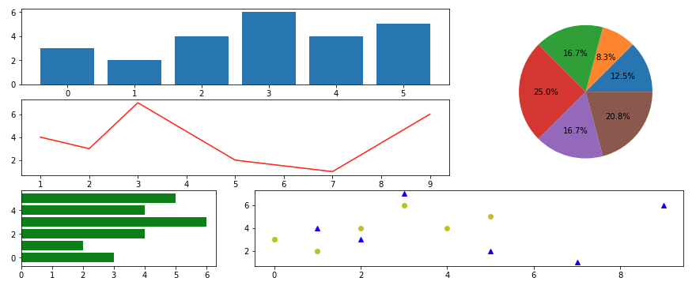
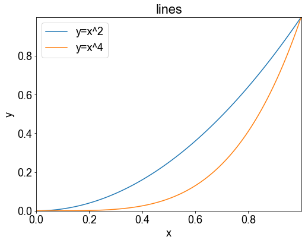
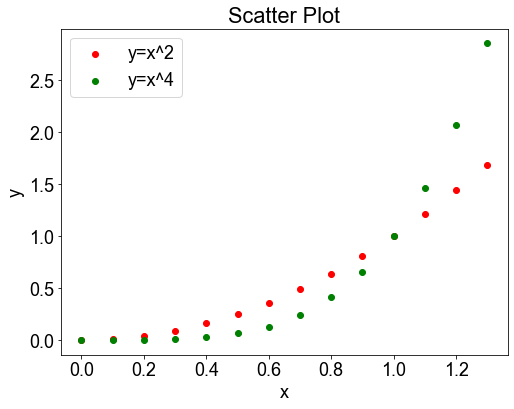
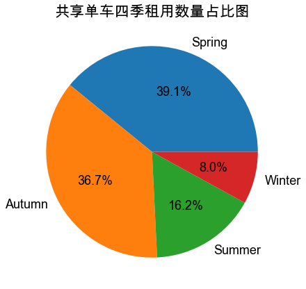
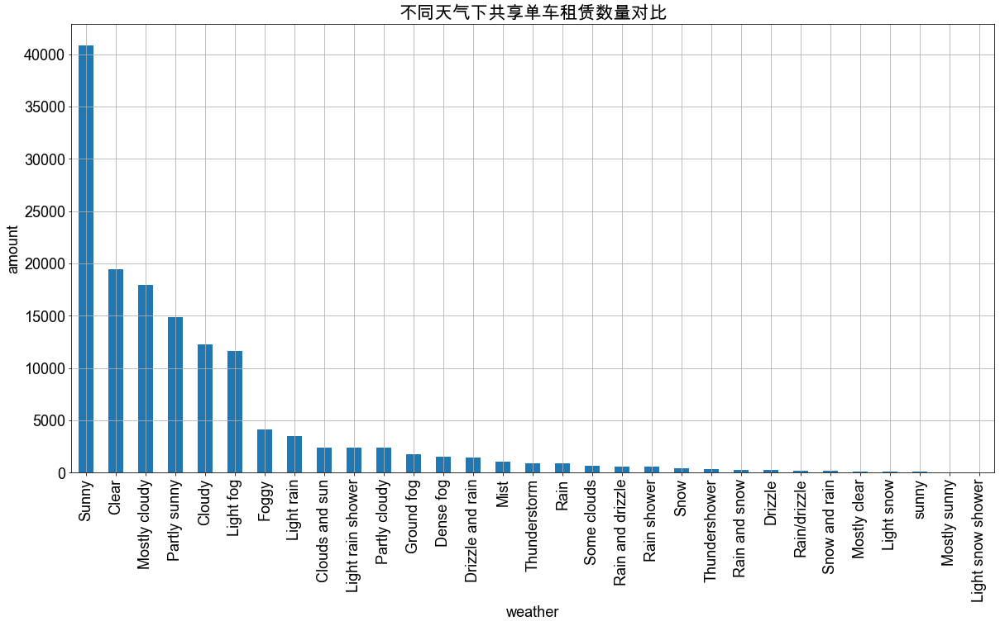
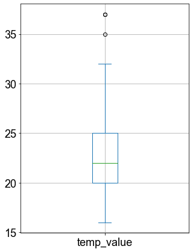
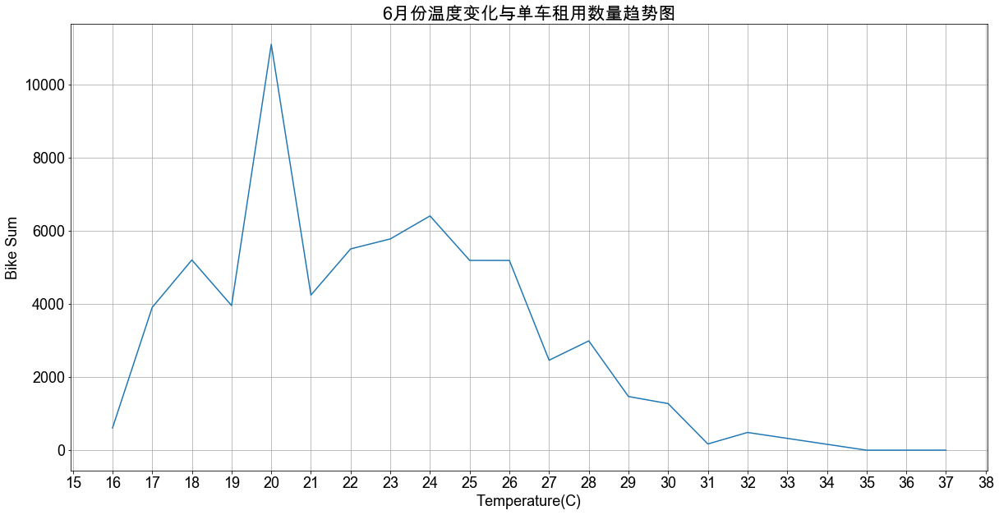
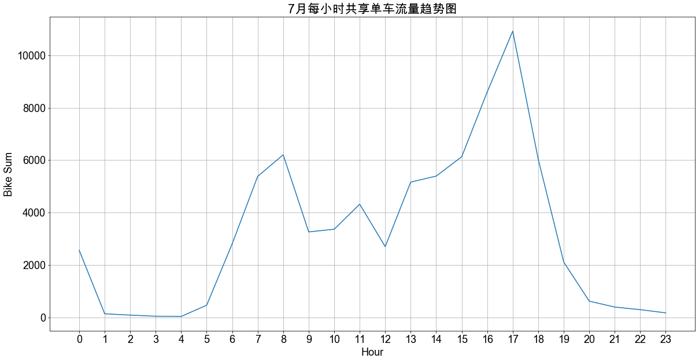

# 4.数据探索和可视化

## 4.1 可视化图表类型

从下面图中我们可以看到图表中经常会用到的几种数据图形,但不仅限于这些图表，我们可以运用`matplotlib`这个库，创建更多适合我们数据分析的图表。当然，pandas自己也继承了`matplotlib`中很多优点，所以我们可以在pandas中直接调用DF对象的plot功能函数，可以直接绘图，从而避免和省去不要的代码学习麻烦。可以更加高效专注于数据本身的探索和挖掘。<br>
<br>
* 常见图表介绍<br>
1.**柱状图**：是由一系列高度不等的纵向条纹或线段表示数据分布的情况，一般用横轴表示数据所属类别，用纵轴表示数量或者占比。用柱状图可以比较直观地看出产品质量特性的分布状态，便于判断其总体质量分布情况。<br>
2.**折线图**：是一种将数据点按照顺序连接起来的图形,可以看作是将散点图按照x轴坐标顺序连接起来。折线图的主要功能是查看因变量y随着自变量x改变的趋势,最适合用于显示随时间(根据常用比例设置)而变化的连续数据,同时还可以看出数量的差异和增长趋势的变化。比如：时间、温度、速度等。<br>
3.**饼图**：是将各项的大小与各项总和的比例显示在一张“饼”中，以占“饼”的面积大小来确定每一项的占比。饼图可以比较清楚地反映出部分与部分、部分与整体之间的比例关系，易于显示每组数据相对于总数的大小，而且显示方式直观。<br>

### 4.1.1 曲线图和散点图介绍

前面我们介绍了三种常见的图表，后面会运用到，当然在`matplotlib`中还两种图（曲线图、散点图）比较适合我们进行数据分析或者进行别的数据观察使用，下面将一一介绍。

* **曲线图 P104**<br>
有时候我们可能需要将一个数学公式具体化，这时候就可以用matplotlib中的`legend`功能函数，它会对相关的函数公式进行绘图处理。

- 示例代码
```python
import numpy as np
import matplotlib.pyplot as plt

data = np.arange(0, 1.1, 0.01) #在[0,1.1) 区间内，以0.01为间隔，创建一维数组
plt.figure(figsize=(8,6))

plt.title('lines') #添加标题
plt.xlabel('x')    #添加x轴的名称
plt.ylabel('y')    #添加y轴的名称
plt.xlim((0,1))    #确定x轴范围
plt.ylim((0,1))    #确定y轴范围
plt.xticks(np.arange(0,1,0.2))  #确定x轴刻度
plt.yticks(np.arange(0,1,0.2))  #确定y轴刻度

plt.plot(data, data**2)       #添加 y = x ^ 2曲线
plt.plot(data, data**4)       #添加 y = x ^ 4曲线
plt.legend(['y=x^2','y=x^4'])

plt.show()
```
- 输出结果<br>



* **散点图 P105**<br>
散点图(scatter diagram)又称为散点分布图，是以一个特征为横坐标，以另一个特征为纵坐标，利用坐标点(散点)的分布形态反映特征间统计关系的一种图形。散点图中，值由点在图中的位置表示。<br>
>散点图可以提供两类关键信息:<br>
>1. 特征之间是否存在数值或者数量的关联趋势，以及关联趋势是线性的，还是非线性的。
>2. 如果某一个点或者某几个点偏离大多数点，则这些点就是离群值，通过散点图可以一目了然，从而可以进一步分析这些离群值是否会在建模分析中产生很大的影响。

pyplot中绘制散点图的函数为`scatter()`，示例代码如下所示：

- 示例代码
```python
import numpy as np
import matplotlib.pyplot as plt

data = np.arange(0, 1.4 , 0.1) #在[0,1.4) 区间内，以0.01为间隔，创建一维数组
plt.figure(figsize=(8,6))

plt.title('Scatter Plot') #添加标题
plt.xlabel('x')    #添加x轴的名称
plt.ylabel('y')    #添加y轴的名称

plt.scatter(data, data ** 2, c = 'r', marker='o')
plt.scatter(data, data ** 4, c = 'g', marker='o')

plt.legend(['y=x^2','y=x^4'])
plt.show()
```
- 输出结果<br>   

    
### 4.1.2 初始化图表格式
在之后的图表操作中，我们需要对图表的样式做一些统一的设定，所以下面有初始化的一些代码。我们通过魔法命令生成文件，之后可以通过魔法命令运行和调用。

- 示例代码
```python
%%writefile Font_Style.py
#写入魔法命令，设定图表样式

import matplotlib.pyplot as plt
import platform

sys = platform.system().lower()#获取系统类型
if(sys == 'win32'): #判定系统类型
  plt.rcParams['font.sans-serif'] = ['SimHei'] #windows os下支持中文，用于正常显示中文标签
else:
  plt.rcParams['font.sans-serif'] = ['Arial Unicode MS'] #mac os 下显示中文 二选一 两行代码
#end if
plt.rcParams['font.size'] = 18 #调整字体大小
#以上-------字体格式代码，根据运行环境自行调整------------------------------
```
- 输出结果<br> 
```
Writing Font_Style.py
```

## 4.2 问题探索

在1.2中我们提出了“通过历史用车记录结合天气等数据预测共享单车项目在该地区的需求。”这么一个问题。既然说到天气，我们不难从数据表格中发现“season”、“weather”、“temp_value”、“wind_speed”这四个参数是天气数据，可以用于来进一步分析。为了便于我们的讲解，我们这里就选去了前三个数据进行分析和讲解，即“season”、“weather”、“temp_value”是我们这次重点分析的三个对象。我们将对这三个数据逐步深入的讨论以下几个问题：
1. **共享单车四季租用数量占比（饼图）**
2. **不同天气情况下共享单车的租用数量（柱状图）**
3. **某一个月中温度对共享单车租用影响（箱图、折线图）**
4. **某一个月中每小时单车租用情况（折线图）**

## 4.3 共享单车四季租用数量占比

在第3节中我们经过“查重”、“删空值”、“删特殊值（#VALUE）”等一系列操作，好像已经处理得很完美了，那么我们现在要根据季节来分析一下数据。这时候我们发现又有一个坑等着我们了，就是数据中只有“Summer”的数据，没有别的季节数据。回溯原因，可能是在前面的处理中有些数据中可能只有季节数据，后面的天气等详细数据都是缺失没有的，导致数据都被删除，所以这里的数据我们又要重新清洗。不过还好比较简单，因为只需要提取季节数据，所以只要“查重”就行了，我们初始化的导入代码如下所示：

### 4.3.1 导入数据初始化代码

```python
import pandas as pd #导入pandas库

DataFilePath = "./bike_data.csv" #需要分析的数据文件路径
BikeDataFrame = pd.read_csv(DataFilePath,encoding='gb2312') #建立BikeDataFrame对象访问数据

#-----初步处理-------
BikeDataFrame.drop_duplicates(subset = ['bike_id','datetime','date'],  keep = 'first' , inplace = True) #删除重复的数据
```

### 4.3.2 显示四季占比数据 P109

- 示例代码
```python
%run "Font_Style.py"

SeasonCount = BikeDataFrame['season'].value_counts()#选取season属性数据，同时进行计数
piefig = SeasonCount.plot.pie(title ="共享单车四季租用数量占比图",figsize=(7,7),autopct = '%1.1f%%',ylabel="")
```   
- 输出结果<br> 

    


* 代码解析<br>

`SeasonCount = BikeDataFrame['season'].value_counts()` <br>
>**BikeDataFrame['season']**: 获取数据中season这一列数据<br>
**value_counts()**: 给相同数值的数据进行分类计数<br>
**SeasonCount**: 最后将统计好的数据赋值给“SeasonCount”对象，类型为Series(属于pandas)

`SeasonCount.plot.pie(title ="共享单车四季租用数量占比",figsize=(8,8),autopct = '%1.1f%%',ylabel="")`<br>
>**.plot.pie**: 直接调用pandas自带的plot画图功能函数下的画饼图（pie）功能<br>
**title**: 图表标题<br>
**figsize**: 图表大小（单位：英寸）<br>
**autopct**: 显示所占百分比<br>
**ylabel**: y轴显示标签，这里我们使用空字符，不显示

### 4.3.3 结论

直观数据结论：我们可以发现春秋两季租用人数占比较多，占比数据相近，且租用人数较多。冬夏两季租用占比较少，租用人数较少，尤其冬天占比只有夏天的一般。<br>
分析：春、秋气候适宜，适合出行。冬、夏气候较为极端，会影响出行人数。

## 4.4 不同天气情况下共享单车的租用数量

前面我们通过对季节数据进行了分析，接下来我们在观察一下不同天气对出行的影响，从而导致对共享单车的租赁数量的影响。

### 4.4.1 导入数据初始化代码

在上一章节中我们讨论过因为季节数据的关系，我们对数据只是初步处理。但是这里我们需要天气数据，所以对数据进行了完善处理，可以直接沿用3.2.6中的代码，我们直接使用魔法命令来调用。代码如下所示：

- 示例代码
```python
%run import_data_CleanUP.py
#使用魔法命令，导入清洗过的数据数据
```

### 4.4.2 显示天气数据 P108

- 示例代码
```python
%run "Font_Style.py"

WeatherData = BikeDataFrame['weather'].value_counts() #统计不同天气情况下租赁的车辆
WeatherData.plot.bar(title ="不同天气下共享单车租赁数量对比",xlabel = "weather",ylabel = "amount",
                     figsize=(20,10),grid = True) #画柱状图
```
- 输出结果<br>

    

* 代码解析<br>
`WeatherData.plot.bar(title ="不同天气情况下单车租赁情况对比",xlabel = "weather",ylabel = "amount",figsize=(20,10),grid = True)`<br>
>**xlabel、ylabel**: 表示设定对应轴上的标签<br>
    **grid**: 表示显示网格<br>

### 4.4.3 结论

通过图表我们不难发现，只要是晴好天气租赁数量比较多，下雨、大雾、下雪等影响骑行出行的天气，租赁车辆的人集聚减少。因为这些天气对骑行有一定程度的影响。

### 4.4.4 思考题
我们从上面的数据中可以发现一些问题，比如sunny数据有两个，是首字母大小写不一样导致，还有sunny的天气类型有很多，rain的天气类型有很多，还有snow的类型也有很多，我们是否需要这么细分天气？是不是需要将这些天气数据再“清洗一下”？并且同时将天气数据分为大类别？这样便于我们在宏观层面分析，当然也可以保留这些数据，有可能在具体情况下也需要进行具体问题分析，比如rain的天气情况下，不同的rain对单车租赁的影响也是有不同的，这时候就又需要我们细化去分析。那么，这个问题就留给读者去思考了。

## 4.5 某一个月中温度对共享单车租用影响（以6月份数据为例）

### 4.5.1 查看是否有异常数据

前面我们已经导入过清洗好的数据了，这里我们可以直接调用`BikeDataFrame`进行数据分析。在清洗完的数据中，6月份的数据比较完整，所以我们这里使用6月份的数据进行分析。同时这里我们需要注意，在统计分析前，我们需要显查看一下是否有异常值的数据，这样以便于我们对后面的数据分析有一个更加好的决断。

- 示例代码
```python
%run import_data_CleanUP.py
%run Font_Style.py
#使用魔法命令，导入清洗过的数据数据和设定好的格式参数

TempData = BikeDataFrame[BikeDataFrame['month'] == 6] #选取6月份数据。
TempData['temp_value'] = TempData['temp_value'].apply(round) #整理温度数据，进行四舍五入
TempData['temp_value'].plot.box(figsize=(5,7),grid = True) #调用一下箱图查看一下是否有异常数值
```
- 输出结果<br>


* 代码解析<br>

`TempData['temp_value'] = TempData['temp_value'].apply(round)`<br>
>**apply**: 对选取的数据应用某一个功能函数<br>
**round**: 对数据进行四舍五入，仅保留整数部分<br>

`TempData['temp_value'].plot.box(figsize=(5,7))`<br>
>**plot.box()**: 调用箱图功能<br>

* **箱形图 P110**<br>
能提供有关数据位置和分数情况的关键信息，尤其在比较不同特征时，更可表现其分散程度差异。图3.26标出了箱形图中每条线所表示的含义。箱形图利用数据中的五个统计量(最小值、下四分位数、中位数、上四分位数和最大值)来描述数据。四分位数也称为四分位点,是把所有数据由小到大排列并四等分后,处于三个分割点位置的数值。处在25%位置上的四分位数称为下四分位数,处在75%位置上的四分位数称为上四分位数,处在中间的四分位数即为中位数。利用箱形图,可以粗略地看出数据是否具有对称性以及数据分布的分散程度等信息,也可以用于对数据进行异常值检测。<br>
如上图所示：
>最小值 : 16<br>
>下四分位数 : 20<br>
>中位数 : 22<br>
>上四分位数 : 25<br>
>最大值 : 32<br>
>异常值 : 35、37

### 4.5.2 显示温度数据 P107

从上面的箱图结果我们可以看到，有35度和37度两个异常值，那么在接下来的数据分析中，我们就需要排除这两个数据选项。同时一半数据集中在20-25度左右，这是需要我们注意观察的数据区域。下面我们将对每一个温度进行计数统计，来观察温度与租借量的关系。

- 示例代码
```python
%run "Font_Style.py"

TempCount = TempData['temp_value'].value_counts().sort_index() #统计不同温度下租赁单车的数据,结果并按照温度排序
Tempfig = TempCount.plot(title="6月份温度变化与单车租用数量趋势图" ,xlabel = "Temperature(C)",ylabel = 'Bike Sum',
               figsize=(20,10),grid = True,xticks = range(15,39)) #将数据结果用折线图显示
```
- 输出结果<br>    

    


* 代码解析<br>
`TempCount.plot(title="6月份温度变化与单车租用数量趋势图" ,figsize=(20,10),grid = True,xticks = range(15,39))`
> **plot** 默认plot为折线图<br>
    **xticks** 表示x轴坐标开始与结束数值，可以用range函数赋值

### 4.5.3 结论


17至26度这段区间温度比较适宜，单车租用量比较大，通过箱图和折线图都能反应这一点。舒适的温度让人更加倾向租用共享单车，但是高温和较低的温度会降低用户租用单车的意愿。

## 4.6 某月每小时单车租用情况（以7月份数据为例）练习

- 示例代码
```python
%run import_data_CleanUP.py
%run Font_Style.py
#使用魔法命令，导入清洗过的数据数据和设定好的格式参数

HourData = BikeDataFrame[BikeDataFrame['month'] == 7] #选取7月份数据。
HourCount = HourData['hour'].value_counts().sort_index()
hourfig = HourCount.plot(title="7月每小时共享单车流量趋势图" ,xlabel = "Hour",ylabel = 'Bike Sum',
               figsize=(20,10),grid = True,xticks = range(0,24))
```
- 输出结果<br>    

    
* 结论<br>
1. 上午时段租赁小高峰出现在6-8点，之后回落一些。
2. 9-15是一个平缓期，但仍然有很大的需求量。
3. 16-19点是晚高峰，单车需求量达到最大。<br>
根据上述三组分析我们可以得出，早上到中午大家出行时间较为分散，单车需求量一直维持在**5千辆**左右，到了晚高峰单车需求量急剧增加，是一天中最大需求量(*17点到达近1万辆*)，这个时间段是需要重点关注。
